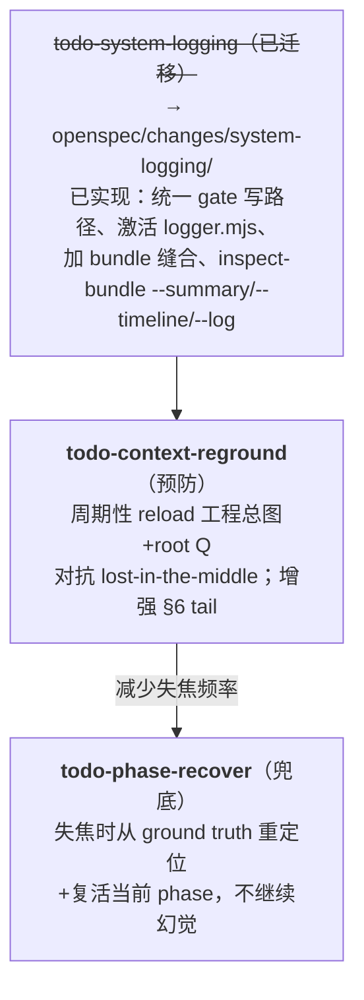
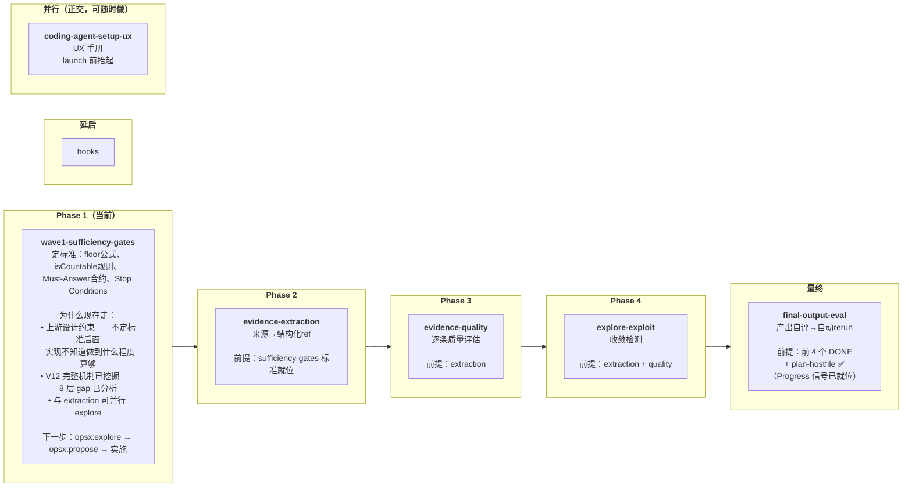

# _backlog — 项目待办与决策记录

> 最后更新: 2026-06-26 | 本目录追踪项目的工作项、设计决策、依赖分析。
> 活跃工作走 OpenSpec（`openspec/changes/`）；本目录是 **上游分析与决策记录**，不是运行时真相。
>
> **本文件是 `_backlog` 的规矩手册。** todo→done 的判定与搬迁流程在下面定死，今后大家都遵循这里头定的规矩。

## 目录结构

```
_backlog/
├── README.md                          # 本文件（规矩手册 + 索引）
│
├── done/                              # ✅ 已完成/已归档的分析与决策记录
│   ├── DONE-*.md ×12                  #   单条已完成的 TODO/分析
│   ├── _fixed_bugs/                   #   已修复的 Bug 记录（4 个）
│   ├── _old_topics/                   #   已归档的历史文件夹
│   │   ├── _v12-migration/            #     V12→Agentic DPT 迁移记录（6 change 全 DONE）
│   │   ├── _workflow/                 #     Workflow Foundation 需求与拆解（8 change 全 ARCHIVED）
│   │   ├── _original_dpt_requirement/ #     原始需求归档（⚠️ 勿读，除非显式要求）
│   │   ├── _original_dpt_v12/         #     原始 V12 归档（⚠️ 勿读，除非显式要求）
│   │   ├── _guideline/                #     术语对齐审计
│   │   └── _trainsistion/             #     Transition 层设计分析
│
├── todo-*.md ×9                       # 📋 待设计/待实现的 TODO
│   ├── todo-wave1-sufficiency-gates.md  #  Wave 1 充分性门槛——从 V12 挖掘的 8 层 gap 分析
│   ├── todo-evidence-extraction.md    #   证据提取（来源→结构化 reference，含干货）
│   ├── todo-evidence-quality.md       #   证据质量评估——不够格就放弃
│   ├── todo-explore-exploit.md        #   搜索收敛检测与方向决策
│   ├── todo-final-output-eval.md      #   最终产物评估——不够格就自动 rerun
│   ├── todo-hooks-deferral.md         #   6 个 Boundary Hook（延后）
│   ├── todo-phase-recover.md          #   模型失焦的状态恢复——兜底（低，parked）
│   ├── todo-context-reground.md       #   长上下文定期重锚——预防（低，parked）
│   └── todo-coding-agent-setup-ux.md  #   用户手册：怎么配 coding agent 才不卡（Claude Code + Codex）
│
└── bugs/                              # （空，预留）
```

---

## todo → done 的规矩 ⭐

**这是本目录最核心的规矩。今后判定和搬迁一律照这里走。**

### 1. todo 和 done 的区别

| | `todo-*.md`（根目录） | `done/`（含 `DONE-*.md` 与子目录） |
|---|---|---|
| **含义** | pending / in-progress 的上游分析与决策 | 已结论、已完成、已归档的记录 |
| **谁在里头** | 还在想、还在设计、还在实施的工作项 | 工作已告一段落，留作决策历史与查阅 |
| **位置** | `_backlog/` 根 | `_backlog/done/` |
| **命名** | `todo-<name>.md` | `DONE-<name>.md`（保留 `DONE-` 前缀，**位置 + 前缀双重标识**） |

### 2. done 在 `_backlog` 内部判定，**独立于 OpenSpec**

> 🔒 **铁律：`_backlog` 是独立的决策记录层。一个 item 是否 done，由项目判断并记录在 `_backlog` 内，与 OpenSpec 的 `openspec/changes/archive/` 归档状态、`openspec/specs/` spec 同步状态无关。**
>
> OpenSpec 是另一层"运行时真相"；`_backlog` 是"上游决策记录"。**两层各自簿记，不交叉判定。** 不要为了在 `_backlog` 标 done 而去动 OpenSpec，也不要因为 OpenSpec 没归档就不敢在 `_backlog` 标 done。

### 3. 一个 todo 做完之后，怎么进档（Move ritual）

当一个 todo 的工作**结论性完成**，执行以下步骤：

```bash
cd _backlog
# ① 改前缀 todo- → DONE-，并移入 done/
git mv todo-<name>.md done/DONE-<name>.md
```

- **内容原样保留**——DONE 文件就是当年的分析/决策原文，不重写、不加"完成总结"。唯一改动：把 frontmatter 的 `> 状态:` 行改成 `已完成（已移入 done/）`，`> 更新:` 日期改成今天。
- 整批完成的**记录文件夹**（如 `_v12-migration/`）：`git mv _<folder> done/`（保持子目录结构，前缀不动）。
- 用 `git mv`（不是普通 `mv`）以保留 git 历史。`_backlog` 全目录受 git 追踪。

### 4. 搬完之后，连带更新本 README

每搬一次，按需要更新这几处（别漏）：

| 更新处 | 怎么改 |
|--------|--------|
| **目录结构** 树 | done/ 的 `DONE-*.md ×N` 计数 +1；根 `todo-*.md ×N` 计数 -1；新文件夹加进 done/ 树 |
| **状态总览** | DONE 计数 +1；"关键完成项"加一条 bullet |
| **PENDING 表** | 删掉该行，下面的行重新编号 |
| **推荐执行顺序** | 如果它正好是 current，换一个新 current 并重写 rationale |
| **快速查阅指南** | DONE 文件引用路径从根改为 `done/DONE-...` |

### 5. 反向：done 能回 todo 吗？

极少见，但可以——`git mv done/DONE-<name>.md todo-<name>.md`，改回 `> 状态:`，更新 README。只有当结论被推翻、工作重新启动时才这么做。

---

## 状态总览

### ✅ DONE（已完成/已归档，在 `done/`）

12 个 `DONE-*.md` + `done/_old_topics/`（含 `_v12-migration`/6 change、`_workflow`/8 change、`_original_dpt_requirement`、`_original_dpt_v12`、`_guideline`、`_trainsistion`）+ `done/_fixed_bugs/`（4 个已修复 bug）。

关键完成项：
- **prototype loop engineering**：gate-loop、gate-fork、subagent 三个原型全部 DONE，对应的 OpenSpec change 已归档
- **queue engine**：`queue-manager.mjs` 完整实现，AGQ-001~006 全部 accepted，3 个 playbook 验证通过
- **workflow foundation**：10-phase lifecycle 完整实现，19 phase node MD + 6 shared node MD，9 gate CLI
- **queue-loop 接入**：seed-topics + wave0 + wave1 三个 phase 已接入 queue-driven 三阶段，6 个 playbook 验证通过
- **实验验证**：16 个 experiment playbook，5 个 prototype 实验
- **rerun-incremental-node**（2026-06-26）：HITL2 增量重跑节点——薄层 phase-rerun + gate + chain 边 `rerun → seed-topics`，5 个设计问题全解。详见 `done/DONE-rerun-incremental-node.md`
- **plan-hostfile-sections**（2026-06-26）：`rb_plan.md` 内部 Section 化（`## Goal`/`## Topic Registry`/`## Constraints`/`## Progress`/`## Decisions`），不改名、Frontmatter 不变。解锁 context-reground 的北星锚点与 final-output-eval 的完成度信号。详见 `done/DONE-plan-hostfile-sections.md`

### 📋 PENDING（待设计/待实现，在根目录）

| # | 文件 | 优先级 | 简述 | 阻塞条件 |
|---|------|--------|------|----------|
| 1 | `todo-wave1-sufficiency-gates.md` | **最高（当前优先）** | Wave 1 充分性门槛——从 V12 的完整机制挖掘出 8 层 gap：研究画像 + 动态 floor 公式 + 证据质量阶梯 + Must-Answer 合约 + Topic-Unique 要求 + Stop Conditions + 探索/利用决策验证 + 自主推进阻止。**先定"跑到什么程度算够"的标准，再让 evidence-extraction 等实现去对齐。** | 无硬阻塞——本 TODO 是上游设计约束，不是下游实现 |
| 2 | `todo-evidence-extraction.md` | **高** | 来源→结构化 reference（含硬数据/干货，不只是元数据） | prototype-subagent ✅, prototype-gate-fork ✅ |
| 3 | `todo-evidence-quality.md` | **高** | 逐条证据质量评估——不够格就**放弃**（discard，不是 repair） | evidence-extraction（流水线上游） |
| 4 | `todo-explore-exploit.md` | **高** | 搜索收敛检测与方向决策（wave 级） | subagent ✅, gate-fork ✅, evidence-quality 集成 |
| 5 | `todo-final-output-eval.md` | **中** | 最终产物整体评估——不够格就自动 rerun（不等用户） | evidence-quality + explore-exploit 信号；plan-hostfile ✅（提供 Progress 信号） |
| 6 | `todo-hooks-deferral.md` | **延后** | V12 的 6 个 Boundary Hook | evidence 管理器就位 |
| 7 | `todo-phase-recover.md` | **低（parked）** | 模型失焦时从 ground truth 重新定位并复活当前 phase（兜底层） | 无硬阻塞；与 context-reground 真相源对齐 |
| 8 | `todo-context-reground.md` | **低（parked）** | 长上下文定期 reload 工程总图+root question，对抗 lost-in-the-middle（预防层） | 无硬阻塞；plan-hostfile ✅ 提供 `## Goal` 北星 |
| 9 | `todo-coding-agent-setup-ux.md` | **中（launch 前抬起）** | 用户手册：怎么配 Claude Code/Codex 的 permission/approval 才能让框架 HITL1↔HITL2 自主跑不卡 | 无硬阻塞；真跑一次完整 research 的前置 UX 条件 |

### 🔮 分析文档中标记但未建 TODO 的待办

| 来源 | 内容 | 状态 |
|------|------|------|
| `done/DONE-agentic-queue-landing-analysis.md` | wfq-wave1-intake-subagent（Change 2） | ✅ OpenSpec 已归档（`2026-06-24-wfq-wave1-intake-subagent`） |
| 同上 | wfq-wave2-synthesis（Change 3） | ✅ OpenSpec 已归档（`2026-06-24-wfq-wave2-synthesis`） |
| 同上 | wfq-delivery（Change 4） | ✅ OpenSpec 已归档（`2026-06-23-wff-content-delivery`） |
| `done/_old_topics/_guideline/terminology-gap-audit.md` | ~253 处术语 gap 修复 | 无执行计划 |
| `done/_old_topics/_trainsistion/` 全部 3 文件 | Transition 层清理（FSM dispatch bug + API 统一） | 发现但未建 change |

## 依赖链分析

### 核心流水线：wave1-sufficiency-gates（定标准）→ evidence-extraction → evidence-quality → explore-exploit → final-output-eval

**`todo-wave1-sufficiency-gates` 是上游设计约束**——它从 V12 的完整机制挖掘出 8 层 gap（研究画像 + 动态 floor 公式 + 证据质量阶梯 + Must-Answer 合约 + Topic-Unique 要求 + Stop Conditions + 探索/利用决策验证 + 自主推进阻止），定义"跑到什么程度算够"。evidence-extraction/quality/explore-exploit 是实现手段，它们的"做到什么程度"由 sufficiency-gates 定的标准决定。

三个层次，从细到粗：


**关键洞察**：evidence-extraction 解决根本信任问题——**`ref_count` 变成 Engine 计算的派生值**，不再由 Agent 声明。这直接解锁 evidence-quality（评估 Engine 已计数的 reference），进而解锁 explore-exploit（收敛需要可信的增量统计），最后解锁 final-output-eval（自动 rerun 需要可信的质量信号）。evidence-quality 新增了**放弃**动作——烂材料直接排除，不修。

### 独立项

**`todo-hooks-deferral`** 明确延后，依赖链为：
```
schema-core → prototype-start-from-here → gate-loop/gate-fork → workflows/hooks
```
当前 gate/queue/evidence 引擎尚未全部就位。

### 健壮性 / 元机制（正交于核心流水线，可长期 park）

三个 TODO（#6-8）都针对"模型在长程运行中跑糊涂 / 无法事后排查"，与核心 evidence 流水线**正交**，互不阻塞：



- **reground（预防）vs recover（兜底）互补**：reground 让模型别晕，recover 让模型晕了能救回来。两者共享同一 ground-truth 基座（`rb_status.json` + `rb_profile.yaml` + `rb_plan.md` + 工程总图），设计时真相源要对齐。**plan-hostfile ✅ 已落地**——reground 现在有了 `## Goal` 北星锚点。
- **system-logging 是地基**：recover 直接读 `rb_trace.jsonl` 重建当前 phase，三个 TODO 共享同一 control files。日志做不对，前两者没有真相源。三者中优先级最高（launch/排障前抬起）。

### 正交的 UX 项

**`todo-coding-agent-setup-ux`**（#9）与上述全正交——它不参与流水线也不参与健壮性层，解决的是"用户怎么配 coding agent 才能让框架真跑起来不卡"。launch/交付前抬起。

## 推荐执行顺序（2026-06-26 更新）

**决定：wave1-sufficiency-gates 现在走。理由：先定"跑到什么程度算够"的标准，再让实现去对齐——否则 evidence-extraction 做了也不知道 floor 该设多少。**



✅ 已完成（已进 done/）：rerun-incremental-node、plan-hostfile-sections
   → rerun 解锁 final-output-eval 的 auto_rerun 落点（为什么比 evidence-extraction 先做完：独立于核心流水线，有专项依赖，解锁 downstream 关键前提）
   → plan-hostfile 解锁 context-reground 北星 + final-output-eval 完成度信号

### 为什么 wave1-sufficiency-gates 现在走

| 维度 | 判断 |
|------|------|
| **上游设计约束** | sufficiency-gates 定"跑到什么程度算够"的标准。不先定标准，evidence-extraction 做了也不知道 floor 该设多少、isCountable 要判哪些字段、Must-Answer 合约该长什么样 |
| **V12 已挖掘清楚** | 完整对比了 V12 的 RESEARCH_PROFILES.md、METHODOLOGY.md、GATES.md、QUEUE_CONTRACT.md → 当前框架的 10 个 gate definition JSON，8 层 gap 已经分析清楚，不是凭空设计 |
| **与 extraction 可并行 explore** | sufficiency-gates 定标准（profile schema + floor 公式 + gate rule 设计），extraction 做实现（enriched reference 格式 + CandidateCard + cache staging）。两件事的 explore 阶段互不阻塞——可以同时 `/opsx:explore` |
| **下一步** | `opsx:explore wave1-sufficiency-gates`（纯设计，定 profile schema + floor 公式 + gate rule 改造方案）→ `opsx:propose` → 实施 |

### 三个 parked TODO（健壮性/元机制，低优先级）

`todo-phase-recover` / `todo-context-reground`（#6-7）**不参与上述执行顺序**——它们正交于核心流水线，当前先记录、不抢跑道，低优先级 long park。`todo-system-logging` 已迁移至 `/openspec/changes/system-logging/` 并已实现。

## 快速查阅指南

### 想看"现在该做什么"
→ 本文的"推荐执行顺序"——**当前：wave1-sufficiency-gates 走**

### 想看 _backlog 的规矩（todo 怎么变 done）
→ 本文的 **"todo → done 的规矩"** 一节

### 想看历史决策
→ `done/_old_topics/_v12-migration/decisions.md`（7 个架构决策）
→ `done/` 下 12 个 `DONE-*` 文件（按文件名主题查阅）

### 想看技术深度
- **queue loop 怎么设计** → `done/DONE-agentic-queue-landing-analysis.md`（59KB，最详细）
- **transition 层的坑** → `done/_old_topics/_trainsistion/review_and_suggestion.md`（FSM dispatch bug + API 统一建议）
- **workflow 怎么拆成 change** → `done/_old_topics/_workflow/openspec-change-map.md`
- **术语怎么乱** → `done/_old_topics/_guideline/terminology-gap-audit.md`

### 想看具体 TODO 的设计思路
→ 对应的 `todo-*.md` 文件，每个都包含：Why、核心挑战、从 V12 借鉴的模式、实验范围（Goals/Non-Goals）、关键设计问题、实现思路、下一步

## 相关外部文件

| 路径 | 角色 |
|------|------|
| `guidelines/project-charter.md` | 项目最高原则（Agent/Engine/Markdown 分工） |
| `guidelines/agentic-execution-model.md` | 三层执行模型 + 术语正典 |
| `openspec/specs/` | 已接受 spec（运行时真相层，与 _backlog 各自簿记） |
| `openspec/changes/` | 活跃 change |
| `DPT_FRAMEWORK/engine/` | engine 模块 |
| `DPT_FRAMEWORK/workflows/` | 10-phase lifecycle + 19 node MD |
| `tests/` | 回归测试（engine/CLI/integration/schema） |
| `experiments_playbook/exp_*/` | Agent-driven E2E 实验 |
