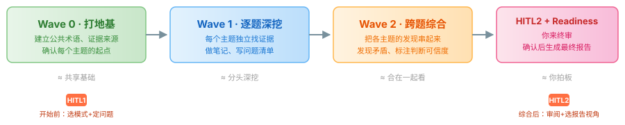
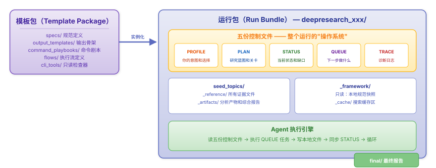
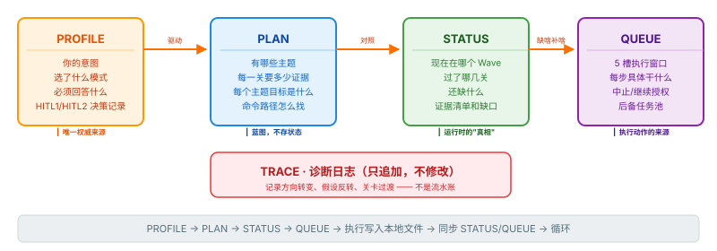
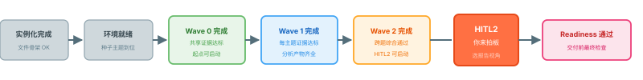
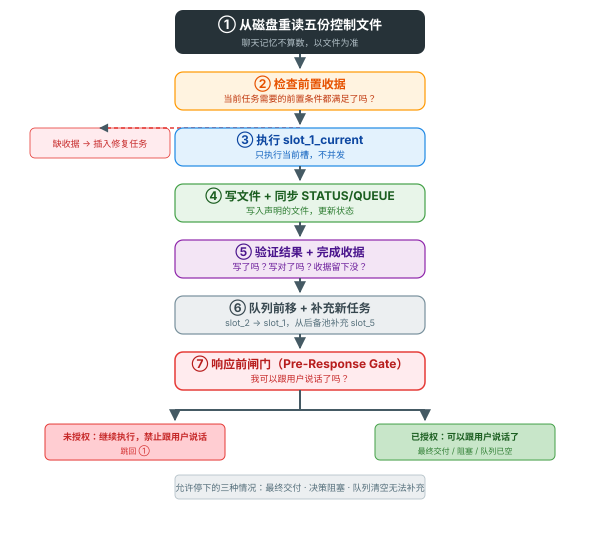

# V12 Deep Research 使用指南

> 给第一次用的人。读完你会知道这东西能干什么、怎么上手、它在背后干了什么。

---

## 一、这东西能帮你干什么

你有一个挺大的问题想搞清楚。比如——

> 端侧 AI 推理芯片，2024 到 2026 年，竞争格局和技术路线到底怎么样了？Apple、Qualcomm、MediaTek 各走各的什么路？

你自己去搞的话，大概是这么个流程：搜几十篇文章，一篇篇读，做笔记，对比各家说法，自己判断哪些可信哪些是吹牛，最后写总结。几天就过去了。中间最累的不是读，是**判断**——这篇文章是干货还是软文？那个数字有没有出处？两个人的说法打架了该信谁？

V12 就是一个帮你干这事的工具。你把问题给它，它自己拆成小块，自己搜，自己判断每篇材料靠不靠谱，自己写笔记，自己检查笔记够不够扎实——最后给你一份**每一句话都能追溯到原始材料**的报告。

整个过程你只需要出现两次：**开始前**告诉它你要什么，**快结束时**告诉它你满意不满意。中间它不会来烦你。

---

## 二、先看一个完整的例子

别急着记概念。我们拿"端侧 AI 推理芯片"这个例子从头到尾走一遍，你就知道这东西怎么用了。

### 2.1 第一步：把问题写下来

你写一个 Markdown 文件，比如叫 `端侧AI推理芯片调研.md`：

```markdown
# 端侧 AI 推理芯片竞争格局（2024-2026）

我想搞清楚三件事：
1. Apple、Qualcomm、MediaTek 各自在端侧推理芯片上走了什么技术路线
2. 三条路线的优劣势分别是什么
3. 未来两年谁更可能领先

特别关注：芯片架构、制程、能效比、软件生态。
```

够了，不用写论文。

### 2.2 第二步：系统帮你拆成"种子主题"

你执行 `instantiate-from-original-topic-md`，系统读了你的文件之后，会把大问题拆成几个**种子主题（seed topic）**——每个主题是一个能独立研究的小问题。对你这个例子，大概会拆成这样：

| 主题编号 | 种子主题 | 要回答什么 |
|----------|----------|-----------|
| 01 | Apple 端侧推理架构 | A 系列/M 系列芯片的 NPU 设计、性能特征 |
| 02 | Qualcomm 端侧推理路线 | Hexagon NPU 演进、AI Engine 能力 |
| 03 | MediaTek 端侧推理路线 | APU 迭代、天玑平台的 AI 能力 |
| 04 | 三条路线交叉对比 | 架构取舍、制程依赖、软件生态差异 |

每个主题会被写成一个独立的 Markdown 文件，带上一套标准结构——当前知道什么、还不知道什么、去哪些地方找证据。

> **种子主题**是 V12 里最重要的概念。它约等于"一个能独立搜、独立验证的小问题"。一个大问题拆成 N 个种子主题，每个主题各找各的证据，最后再合在一起看。这个"拆→分头挖→合"的思路贯穿全程。

### 2.3 第三步：告诉系统你要什么（HITL1）

系统创建好环境之后，会问你两个问题。

**第一个问题：你想要哪种结果？**

```
A. 快速事实答案  —— 我就要知道事实，快一点
B. 探索地图      —— 帮我搞清楚这个领域的全貌，哪清楚了哪还是黑的
C. 说法验证      —— 我要验证一个具体说法到底靠不靠谱
```

假设你选 B（探索地图）——因为你确实想搞清楚全貌。

**第二个问题：最终报告必须回答什么？**

你写一两句话就行。比如：

> 三条技术路线各有什么优劣势？未来两年谁的路线更可能成为主流？

如果你自己也不确定，可以说"我不确定，先帮我拆问题"——系统不会瞎猜，它会把这个当成待办事项，先帮你梳理清楚。

### 2.4 第四步：等着

回答完这两个问题，你就没什么事了。Agent 开始自己跑。

它会经过四个阶段（后面第四章细讲）：

- **Wave 0**：先不深挖任何一个主题。搞清楚基本概念（什么叫"端侧推理芯片"？边界在哪？），找一批高可信的公共材料打底。
- **Wave 1**：一个主题一个主题深挖。搜材料、筛掉营销软文、把靠谱的摘出来、写进对应主题的笔记、标注这轮搜完学到了什么、还有什么没搞明白。
- **Wave 2**：把四个主题的发现放在一起看。Apple 和 Qualcomm 的路线有没有本质矛盾？各家声称的能效比能不能横向比？综合判断可信度有多高？
- **Readiness**：最后验一遍——每句话都能追溯到原始材料吗？有没有偷偷跳过的步骤？

**整个过程你不会收到任何"要继续吗？"之类的消息。** Agent 只在最后叫你。

### 2.5 第五步：你来终审（HITL2）

Agent 跑完之后，会给你看一份决策简报，用大白话写：

> 我已经完成综合。
>
> 目前证据足够回答的是：三条路线的架构差异已经比较清楚，Apple 走统一内存+专用 NPU，Qualcomm 走 DSP+张量加速器融合，MediaTek 走 IP 授权+定制 APU。各自在能效比上都有独立测试数据支撑。
>
> 仍然不足或需要谨慎的地方是：软件生态的对比缺少第三方独立评测数据，各家生态的"好用程度"目前主要靠厂商自己说。未来两年谁能领先的判断，现有证据只能做趋势推断，无法下定论。

然后给你四个选择：

| 选项 | 意思 |
|------|------|
| A. 继续生成最终报告 | 现有证据够用了，出报告吧 |
| B. 换一种报告视角 | 比如改成"证据地图"或"技术深挖"的角度 |
| C. 继续补证据 / 重跑 | 有些地方还不够，先补缺口再重新综合 |
| D. 停止，保留阻塞原因 | 现在确实给不了结论，把为什么记录清楚 |

你选了 A，它就开始生成最终报告。

### 2.6 最终你拿到什么

`deepresearch_端侧AI推理芯片/` 目录下，你会看到：

```
deepresearch_端侧AI推理芯片/
├── 端侧AI推理芯片.profile.md    # 你选了什么模式、要回答什么
├── 端侧AI推理芯片.plan.md       # 四个主题的蓝图
├── 端侧AI推理芯片.status.md     # 每一步的审计结果
├── 端侧AI推理芯片.queue.md      # Agent 的执行记录
├── 端侧AI推理芯片.trace.md      # 关键决策的诊断日志
├── seed_topics/
│   ├── _reference/              # 所有被接受的材料（每篇一个文件）
│   │   ├── 00-shared-端侧推理定义与边界.md
│   │   ├── 01-apple-npu-architecture.md
│   │   ├── 02-qualcomm-hexagon-evolution.md
│   │   └── ...
│   └── _artifacts/
│       ├── wave1_topics/        # 每个主题的分析产物
│       │   ├── 01-apple-arch/
│       │   │   ├── evidence-summary.md
│       │   │   └── question-list.md
│       │   └── ...
│       └── wave2/
│           ├── cross-topic-synthesis.md   # 跨主题综合
│           └── human-decision-brief.md    # 给你的决策简报
└── final/                       # 最终报告
    └── 探索地图报告.md
```

**重点**：`_reference/` 里的每一篇材料都标注了来源、可信度、为什么被接受、支持了哪个结论。报告的每一句话都能顺着文件路径追溯回去。三个月后你再看这份报告，不需要回忆"当时那个数字是哪来的"。

---

## 三、上手操作（详细版）

### 3.1 环境准备

确保你在项目根目录，Python 环境已装好：

```bash
uv sync
```

### 3.2 三种研究模式怎么选

这个选择决定了 Agent 的"工作强度"——搜多少材料、查到什么程度算够、怎么对待不确定的东西。

**快速事实答案（quick factual）**

你想查一个具体事实，风险不高。比如"某公司去年发了哪几款芯片"、"某某标准当前版本是什么"。

- 搜得比较少，每个主题大概 5 篇材料打底
- 走完完整流程，但不是 ChatGPT 那种搜两下就回答
- **注意**：涉及法律、合规、医疗、投资决策的事，这个模式不够，请选"说法验证"

**探索地图（exploratory map）**

你刚进一个新领域，想搞清楚全貌——哪些是共识、哪些在打架、哪些是空白。

- 每个主题大概 8 篇材料
- 最终报告像一张地图：标注已知、未知、争议区、优先关注区
- 不强行给你"对/错"的结论

**说法验证（claim verification）**

你想验证一个具体说法靠不靠谱。比如"某公司声称他们的推理速度比竞品快 3 倍"。

- 搜得最多，每主题至少 10 篇
- 每个说法会给：支持证据 + 反对证据 + 反例 + 综合判断 + 可信度
- 证据不够的时候，它不会假装能判断——它会说"这个说法目前无法验证"

### 3.3 启动

```bash
# 从你的 Markdown 文件开始（推荐）
instantiate-from-original-topic-md

# 或者直接创建一个空的运行环境
instantiate-run-bundle
```

然后按提示回答 HITL1 的两个问题，选模式 + 写要回答的问题。之后就不用管了。

### 3.4 中间我能干什么

看 `STATUS.md`。里面记录了当前跑到哪了、过了哪些关、还有哪些缺口。

想改主意——比如觉得证据不够，想加量——用 `adjust-profile-parameters`。但要注意：改参数可能导致已经过了的关卡重新打开（因为新要求可能不满足了），Agent 会回去补课。

### 3.5 终审时四个选项的含义

| 选项 | 什么时候选 |
|------|-----------|
| A. 继续生成最终报告 | 证据够了，出报告 |
| B. 换一种报告视角 | 比如本来想要"快速事实"，现在想看"证据地图" |
| C. 继续补证据 / 重跑 | 有些地方还不行，Agent 会告诉你具体缺什么 |
| D. 停止，保留原因 | 确实给不了结论，把现状记录清楚 |

---

## 四、Agent 跑起来之后在干什么

### 4.1 Wave 0：打地基——先别急着挖

**这一轮不深挖任何一个种子主题。** 它只干一件事：建立公共基础。

- 搞清楚核心概念是什么意思（"端侧推理"到底指什么？跟云端推理的边界在哪？）
- 找一批高可信的公共材料（官方文档、行业标准、学术综述）
- 确认每个种子主题有明确的研究起点

**Wave 0 结束的标志**：每篇公共材料都有完整来源记录 + 可信度标注 + 硬数据摘录（数字、机制、约束条件），不是"大概""据说"这种聊天式摘要。

### 4.2 Wave 1：逐题深挖——一个主题一个主题啃

每个种子主题独立找证据。对每个主题，Agent 会循环做四件事：

1. **搜 + 筛**：搜材料，判断每篇是干货还是软文
2. **写笔记**（seed backfill）：把新证据写入主题文件，标注学到了什么
3. **出两份分析**：
   - `evidence-summary.md`：当前证据能撑起什么结论
   - `question-list.md`：哪些问题已经回答了、哪些还一头雾水、哪些新问题冒出来了
4. **判断下一步**：继续深挖？换个方向？这个主题已经够了？

**关键设计**：每找到一篇对某个主题有用的材料，立刻走完以上四步再去找下一篇。不是攒一堆材料最后统一整理——那样一定会漏。

### 4.3 Wave 2：跨题综合——把所有发现串在一起

所有主题都满足了最低证据要求之后：

- 把每个主题的发现放在一起比较
- 找矛盾（比如主题 01 的证据说 A，主题 02 的证据说非 A）
- 对重要判断标可信度
- 形成综合结论矩阵

结束之后，Agent 写出给你看的**决策简报**。

### 4.4 Readiness：最后验一遍

你选了 A（出报告）之后，Agent 做最后检查：

- 随便一个新人拿到这包文件，30 秒内能找到关键证据在哪吗？
- 所有发现的问题要么回答了，要么明确标了为什么回答不了？
- 没有偷偷跳过的步骤？
- 报告里每句话都能追溯到原始材料？

全过了，才生成最终报告。



---

## 五、它是怎么设计的（机理）

前面讲了"发生什么"，这部分讲"为什么这么设计"。不关心原理可以跳过。

### 5.1 两块拼图：模板 + 运行

V12 把所有东西分成两层：

**模板包（Template Package）**：定义规则。什么算靠谱证据、怎么过每一关、什么情况继续什么情况停。这些规则是只读的，一次定义好就不改。相当于"建筑规范"。

**运行包（Run Bundle）**：每次研究的具体实例。你的意图、拆出来的主题、找到的证据、产生的分析。相当于"一栋具体的房子"。

这两层完全分离。规则不会因为某次运行被改掉，运行数据也不会混进规则里。



### 5.2 五份控制文件——Agent 的"记忆系统"

Agent 不看聊天记录做判断。它的"记忆"是五份 Markdown 文件，存在磁盘上，每次做决策前重新从磁盘读。每份文件只管一类信息，互不越界：



- **PROFILE**：你的意图（唯一权威）。选的模式、要回答的问题、HITL 决策记录。
- **PLAN**：蓝图。有什么主题、每关要多少证据、每个主题的目标。是静态的。
- **STATUS**：运行时"真相"。当前在哪个 Wave、哪关过哪关没过、还缺什么。Agent 做判断只看这个。
- **QUEUE**：下一步干什么。一个 5 槽滚动窗口（当前任务 + 4 个排队）+ 后备池。每个任务写清楚：为什么要做、做完改变什么、怎么验证。
- **TRACE**：诊断日志。只追加不修改。只在方向变了、假设翻了、关卡过了的时候才记一笔。

驱动关系是严格单向的：

> PROFILE 决定意图 → PLAN 设目标 → STATUS 暴露缺口 → QUEUE 填任务 → 执行 → 更新 STATUS → 再来一轮

为什么 Agent 每次都要从磁盘重读这些文件？因为长任务跑起来，聊天上下文可能已经几十页了，靠聊天记忆做判断一定会出错。文件是唯一的真相来源。

### 5.3 关卡系统——每步都得验票

类比盖楼：你不可能在打地基之前砌墙，也不可能砌完墙之前刷漆。V12 的每一关（Gate）都是硬性检查：



**关卡通过不靠"感觉"，靠 STATUS 文件里的审计表。** 具体到数字——不是"我觉得差不多了"，而是"共享材料到了 6 篇、每篇元数据完整、来源可追溯"。

如果后面的发现推翻了前面的结论，对应关卡会重新打开（Gate Reopen），Agent 回去补。

### 5.4 为什么中间不会来烦你

Agent 的执行循环是这样的：



最关键的步骤是第 ⑦ 步——**响应前闸门（Pre-Response Gate）**。Agent 每次干完一件事，必须问自己：

> "我现在有资格跟用户说话吗？"

如果队列里还有活、关卡还没过完、HITL2 还没准备好——答案就是"没资格"，自动回到第 ① 步继续干。

**允许停下来的只有三种情况**：

1. 最终交付准备好了（所有关卡已过、队列已关闭）
2. 遇到必须你来决策的事（比如 HITL2——等你选报告视角）
3. 队列彻底空了、无法补充

"要继续吗？""找到这个了看看？""进度 30% 了还继续吗？"——这些都不是合法停下的理由。

### 5.5 探索还是收手——Agent 的判断力

网上信息良莠不齐，营销内容远多于真信号。V12 有一个完整的判断框架。

**继续搜的信号**：多篇材料指向一个新概念现有主题装不下、核心问题没找到靠谱证据、新发现影响多个主题的结论。

**可以收手的信号**：新增材料在重复已知事实、旧问题被回答新问题不再冒出来、专门搜了反例没找到新东西、核心机制有多个独立高可信来源支撑。

**每篇材料入库前必须过审**：

| 来源类型 | 怎么对待 |
|----------|----------|
| 官方来源（政府、标准组织） | 默认高可信，但仍需交叉验证 |
| 学术来源（同行评审） | 看方法论质量——limitations 写得越诚实越可信 |
| 行业来源（白皮书、咨询报告） | 营销噪声最密——区分"可验证数据"和"不可验证宣称" |
| 社区来源（论坛、博客） | 默认低权重，只用于一手经验和失败案例搜索 |

网页材料尤其严格：SEO 填充不算、营销软文不算、循环引用不算。如果一篇网页只有部分有用，只保留有用部分，其余扔掉。

### 5.6 证据质量比数量重要

"快速事实"虽然叫快速，但不是 ChatGPT 那种搜两下就回答。三种模式唯一的区别是**每关最少要多少证据**：

| 参数 | 快速事实 | 探索地图 | 说法验证 |
|------|----------|----------|----------|
| Wave 0 共享材料最低 | 5-12 篇 | 8-18 篇 | 10-24 篇 |
| 每主题最低材料 | 5 篇 | 8 篇 | 10 篇 |
| 主要来源最少 | 2 篇 | 3 篇 | 4 篇 |
| 限制/失败案例最少 | 1 篇 | 2 篇 | 2 篇 |

所有材料入库前必须：有完整元数据、摘录了硬数据（数字/方法/机制/限制）、通过了网页诊断、写入了主题笔记。不能是"这篇文章讲了什么"这种一句话摘要。

---

## 六、常用命令

### 6.1 使用顺序

一次典型的研究，你只需要用到这几个命令，按顺序：

```
① instantiate-from-original-topic-md   ← 从你的 Markdown 开始
   （然后回答 HITL1 的问题）
   （Agent 自己跑完 Wave 0 → Wave 1 → Wave 2）
② （Agent 在 HITL2 叫你，你选继续或重跑）
③ create-final                         ← 生成最终报告（也可以让 Agent 自动执行）
```

### 6.2 命令速查

| 你想干什么 | 命令 |
|------------|------|
| 从一个 Markdown 开始研究 | `instantiate-from-original-topic-md` |
| 创建空研究环境（高级） | `instantiate-run-bundle` |
| 检查环境是否正确 | `check-instantiation` |
| 中途改参数（加证据量等） | `adjust-profile-parameters` |
| 生成最终报告 | `create-final` |
| 不知道用什么命令 | `help` |

---

## 七、常见问题

**Q: Agent 跑了很久没动静，卡死了？**

大概率在正常干活——搜索、筛材料、写笔记。V12 的设计就是中间不出声。除非你看到明确的中止信号（最终交付 / 阻塞决策 / 队列清空），它在正常跑。

**Q: 我怎么知道现在做到哪了？**

打开 `STATUS.md`。里面有当前 Wave、哪个 Gate 过了、缺口统计。

**Q: 中途想改主意？**

用 `adjust-profile-parameters`。改模式或证据量可能导致已过关卡重新打开，Agent 会回去补。

**Q: 最终报告不满意？**

HITL2 时选 C（补证据/重跑）。Agent 告诉你具体缺什么，补完再来一次 HITL2。

**Q: 不用 Markdown，纯聊天行不行？**

不适用。V12 的核心设计就是文件驱动——状态、证据、判断全落盘。好处是可检查、可追溯、可交接。如果只是快速查一个简单事实，V12 不是那个工具。

---

## 八、词汇表

| 英文 | 中文 | 一句话 |
|------|------|--------|
| Run Bundle | 运行包 | 一次研究的完整文件目录 |
| Seed Topic | 种子主题 | 从大问题拆出的最小可研究单元 |
| Wave | 波次 | 一轮研究阶段：Wave 0 打地基 / Wave 1 逐题挖 / Wave 2 综合 |
| Gate | 关卡 | 每轮结束的硬性审计，过了才能进下一轮 |
| HITL | 人工确认 | HITL1 开始前选模式 / HITL2 综合后审阅 |
| Reference | 证据材料 | 被接受入库的原始材料，含完整元数据和硬数据 |
| Artifact | 分析产物 | 基于证据的衍生分析（摘要、问题清单、综合报告） |
| Seed Backfill | 种子回填 | 把新证据写入主题文件笔记区 |
| Queue | 执行队列 | Agent 下一步干什么（5 槽滚动窗口） |
| Trace | 诊断日志 | 只追加的关键事件（方向变、假设翻、关卡过） |
| Pre-Response Gate | 响应前闸门 | 干完活先检查"有资格跟用户说话吗" |
| Fan-In | 归集 | Agent 回收搜索结果，亲自判断哪些算数 |
| Exploration/Exploitation | 探索/利用 | 判断继续搜还是收束 |
| Anti-Stall | 反卡死 | 一个细节试几次没结果就记下来，先干别的 |

---

第一次用的话，选一个你熟的领域，挑"快速事实答案"模式，跑一次，看看最后那包文件长什么样。看一次实际的输入输出，比读十遍文档管用。
