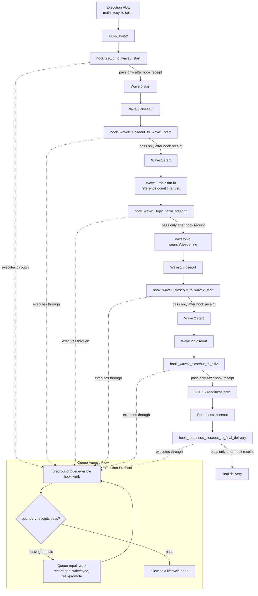
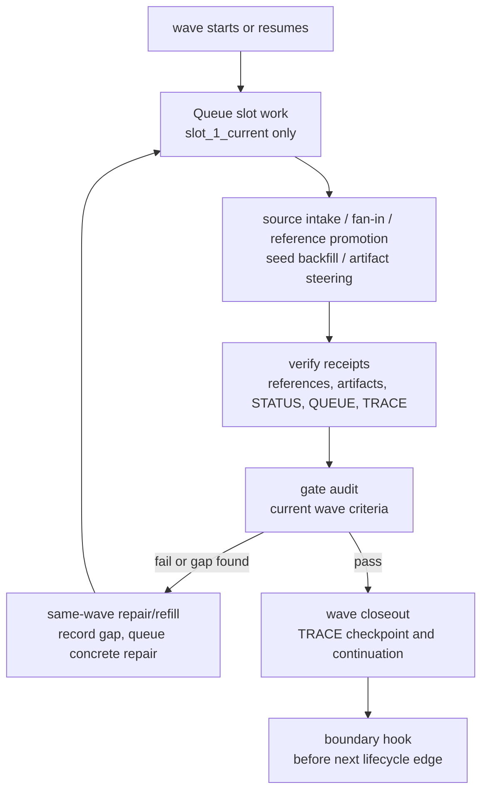

# Execution Flow

Execution Mode initializes the run workspace and advances the research silently and autonomously.

This file is a template policy source. Its `reads` graph is for package policy maintenance, not a runtime instruction to read output skeletons. After a run is instantiated, execution is driven by the generated `PROFILE_PATH`, `PLAN_PATH`, `STATUS_PATH`, `QUEUE_PATH`, `TRACE_PATH`, and local `RUN_DIR/_framework/`, not by reopening the source template package as a runtime launcher.

## Entry Protocol

1. Confirm `PROFILE_PATH`, `PLAN_PATH`, `STATUS_PATH`, `QUEUE_PATH`, and `TRACE_PATH` exist.
2. Confirm instantiation checklist passed.
3. Create or refresh:
   - `<TOPIC_ROOT>/README.md`
   - `<REFERENCE_DIR>/README.md`
   - `<REFERENCE_DIR>/_INDEX.md`
   - `<ARTIFACT_DIR>/README.md`
4. Set status:
   - `current_mode = execution`
   - `current_wave = Wave 0`
   - `current_gate = setup_ready`
5. Set queue:
   - `queue_health = ready`
   - `execution_mode = sequential`

Do not treat setup as a separate wave. `setup_ready` is a non-research transition gate: the execution workspace exists, status and queue are synced, seed growth sections are ready, seed intake has been assessed as `yes` or `gap_queue_backed`, and eligible Wave 0 work can start. It cannot satisfy any evidence floor. If `derived_topic_count=0` or intake is only `gap_queue_backed`, setup may pass only into decomposition/intake repair work, not Wave 0 source intake or Wave 1 deepening.

Before creating or refreshing the execution workspace, confirm run-bundle alignment. `TOPIC_ROOT` must be `RUN_DIR/seed_topics`, `REFERENCE_DIR` must be `RUN_DIR/seed_topics/_reference`, and `ARTIFACT_DIR` must be `RUN_DIR/seed_topics/_artifacts`. Do not use `topics/` as an active V12 topic root. Do not write mutable run state, references, artifacts, `original_topic`, `seed_topics`, or final output into `RUN_DIR/_framework/`.

During setup, repair missing lower growth-tail headings in topic seed files. Do not treat those headings as a substitute for the seed topic upper-section intake standard. If a seed topic lacks concrete `must_answer`, why-now, boundary, evidence anchor, or why-it-matters substance, record the intake gap in status/queue, set `seed_topic_intake_ready=gap_queue_backed` only when concrete repair work exists, and schedule clarification or foundation work before relying on that topic for Wave 1 deepening. The affected topic cannot pass Wave 0 topic-start rows until the gap is resolved.

Execution is sequential. Concurrent branches are not valid unless a first-class flow shape and explicit queue-visible fan-in semantics are added to the current contract.

`RUN_DIR/_cache/` is created only when source intake begins. It is the staging area for retrieval noise control and normalized candidate cards, not an execution prerequisite and not an evidence surface.

## Autonomous Execution Contract

Default execution is silent, autonomous, and long-running. Execution does not start from memory or from a free-form "next thing to try"; it follows the fixed dependency chain:

```text
PROFILE intent, root must-answer, configured profile parameters, and human decisions
-> PLAN targets and configured gates
-> STATUS gaps and audit rows
-> QUEUE executable tasks
-> local file writes plus STATUS/QUEUE sync
-> TRACE checkpoint when a gate or diagnostic turn changes state
```

`specs/QUEUE_CONTRACT.md` defines the Queue object contract: work-unit fields, producer rules, authority boundaries, receipts, and projection constraints. `flows/queue-agentic-flow.md` defines the action loop for receipt preflight, slot execution, verification, writeback, repair, refill, promotion, projection, and Pre-Response Gate.

Long-running agents must treat chat context as disposable. Before any gate audit, Wave transition, HITL2 human decision, Readiness preflight, final output, source-intake fan-in, or Queue promotion, reload `PROFILE_PATH`, `PLAN_PATH`, `STATUS_PATH`, `QUEUE_PATH`, and `TRACE_PATH` from disk.

## Queue Agentic Loop

Use `flows/queue-agentic-flow.md` for the detailed loop:

```text
reload control files
-> checkpoint receipt preflight
-> select slot_1_current
-> execute declared action
-> write declared files
-> sync STATUS / QUEUE
-> verify result and completion receipt
-> refill/promote Queue
-> sync native projection if available
-> run Pre-Response Gate
```

Sequential mode executes only `slot_1_current`. Pending slots, Refill Pool candidates, native projections, trigger lineage fields, and producer-rule promotion conditions do not execute hidden background work.

## Boundary Hook Call Map

Boundary Hooks are named lifecycle call points inside this Execution Flow. They are not a third flow and not a hidden background mechanism. This file owns where each hook is called; `flows/queue-agentic-flow.md -> Boundary Hook Execution Protocol` owns how the hook runs, verifies receipts, writes/syncs state, creates repair work, and promotes/refills Queue work.



At every hook, missing receipts create concrete Queue repair work before the next phase may start. A passed hook is not user-visible stop authorization by itself; the Queue still must pass the Pre-Response Gate.

## Wave Internal Loop Pattern

Wave 0, Wave 1, and Wave 2 are not single-pass linear steps. Each wave repeats the same Queue-driven correction loop until the matching gate audit passes or a real blocker is recorded. This pattern explains the inside of each wave; the Boundary Hook Call Map explains how the run crosses from one wave edge to the next.



Wave-specific work changes, but the loop shape does not:

- Wave 0 loop: shared foundation references, setup/intake repair, and topic-start readiness.
- Wave 1 loop: topic-specific references, fan-in steering, seed backfill, `evidence-summary.md`, and `question-list.md`.
- Wave 2 loop: synthesis artifact, Cross-Topic Conclusion Matrix, conflict handling, and HITL2/readiness preparation.

## Context Hygiene And Source Intake

Long horizontal runs keep the main agent as orchestrator, judge, and fan-in reviewer. Use `flows/source-intake-flow.md` as the replaceable source intake policy:

- Source retrieval, web search, local lookup, database/API query, fetch, and webpage triage write to `RUN_DIR/_cache` first.
- Main agent reads candidate cards, local paths, Queue state, and STATUS pointers before full bodies.
- `_cache` does not count toward source floors, authorize gates, or replace `REFERENCE_DIR/*.md`.
- Source-intake runners are foreground queue-visible work, not detached background work.
- Multiple independent source-intake runners are not formalized in the current runtime model; run one foreground runner at a time or queue separate sequential source-intake tasks.

The default source search route is `native_search`. Exa is active only when explicitly selected by the user or when the Queue work unit states the Exa-specific capability required.

## Stop Authorization And Projection

`QUEUE_PATH -> Active Queue` owns user-visible stop authorization, No-Empty-Queue, Rolling Task Projection, and Post-Gate Continuation. `STATUS_PATH -> Operator View` mirrors compact stop authorization for recovery.

Normal middle-run state remains:

- `stop_authorization_state=unauthorized_continue_required`
- `safe_to_interrupt=no`
- `unauthorized_stop_next_action=<next concrete tool/file/search/check/refill/promotion action>`

Authorized stop states are only `final_delivery`, `decision_blocker`, and `empty_queue_after_refill`. A completed batch, wave milestone, gate pass, artifact refresh, status sync, or known next task is not terminal.

Native todo/task/plan surfaces are projections of `QUEUE_PATH`, not authorities. When available, mirror the active executable window; when unavailable, continue directly from `QUEUE_PATH`.

## Post-Gate Continuation

Wave gates are transition points, not user-visible stopping points. A gate closeout is incomplete until the next non-chat continuation action has been promoted and started, or a real blocker has been recorded.

- After `wave0_complete`, continue into concrete Wave 1 work.
- After `wave1_complete`, continue into concrete Wave 2 work.
- After `wave2_complete`, continue into HITL2 brief preparation and the explicit recorded/resume path.

Every Wave 0/1/2 transition trace must record the continuation action or concrete blocker, and `STATUS_PATH -> Trace Pointer.last_trace_entry` must point to that transition.

## Anti-Stall Degradation

Use bounded attempts on single details:

- try a small number of alternate queries or source routes
- record `limitation / fetch_note / what_would_unlock_it`
- downgrade confidence when evidence is thin
- move the queue to the next non-blocked high-value action

Do not let one missing URL, one inaccessible PDF, or one unresolved micro-fact hold the mainline.

Do not degrade details that affect high-risk, irreversible, compliance, security, cost, or data-loss decisions. Those require a real blocker or a safer branch.

Anti-stall degradation has a run-level budget: if more than three open limitations affect P0/P1 judgments, or more than 20% of active topic must-answer claims rely on degraded evidence, stop normal advancement and refill queue work for evidence repair or record a blocker.

## Exploration And Exploitation（探索 / 利用决策框架）

目的：在"探索新方向"和"深挖已知线索"之间做稳定判断，同时建立信号/噪声鉴别能力。避免机械凑配额，也避免把营销噪声当成信号，漏掉真正改变拓扑的新方向。

### Exploration Signals（探索信号）

出现下面信号时，应该考虑探索新方向而非继续在当前线索上深挖：

- **高频未归类概念 (High-Frequency Unclassified Concepts)**：连续多份 reference 指向同一个现有 topic 难以容纳的新概念、新实体或新机制。这意味着研究拓扑可能需要扩展或重划边界。当同一未归类概念出现在 ≥2 份独立 reference 中时，这是一个强探索信号。
- **未建模维度 (Unmodeled Dimension)**：多个来源指向同一个新的机制、风险、评价维度、生命周期阶段或利益相关者，且该维度未被当前 topic 框架覆盖。未建模维度如果不捕获，会导致最终判断缺少关键变量。
- **核心问题未回答 (Core Questions Unanswered)**：must_answer 仍有实质性空洞，即使配额接近达标。配额是防浅搜的下限，不是"可以不用回答核心问题"的通行证。
- **横向依赖变强 (Cross-Topic Dependency Strengthening)**：新发现会影响多个 topic 的结论、基线、推荐或最终产出结构。单 topic 视角已不足以做出安全判断，需要跨 topic 协调。

### Exploitation Signals（利用信号）

出现下面信号时，应该继续深挖或收束已知线索，而非开启新方向：

- **证据收敛 (Evidence Converging)**：新增材料大多重复已知事实、机制和数字。新 source 不再引入实质性新信息，主要价值在于不同来源间的交叉验证。
- **问题清单收敛 (Question List Converging)**：旧问题逐步被回答，新问题产生速度明显下降。这是最重要的利用信号 — 当探索不再激发新问题时，说明该方向的信号已被充分提取，继续挖掘的边际收益递减。
- **反例搜索饱和 (Counterexample Search Saturated)**：针对限制、争议、失败模式和反例进行了专门搜索，没有发现新的关键反例。这不是说没有反例，而是剩余反例不足以改变核心判断。
- **机制稳定 (Mechanism Stable)**：核心机制已经能用简洁的语言解释，且有多个高可信来源（official/academic）独立支撑，而非仅靠 practitioner 或 community 来源。

### Signal/Noise Judgment Guide（信号/噪声判断指南）

互联网信息真假混杂，营销内容远多于真正有价值的信号。每一份材料在被接受为 reference 之前，必须经过以下判断流程。这不是可选的额外步骤 — 没有判断的收集就是噪声导入。

**来源可信度锚定 (Trust Calibration)**：

- `official`（官方）：政府、标准组织、监管机构、交易所公告。默认高可信，但仍需交叉验证 — 官方来源也可能有滞后、美化或选择性披露。
- `academic`（学术）：同行评审论文、学术机构报告。可信度取决于方法论质量和样本量 — 关注研究局限（limitations）部分的诚实程度，这是区分高质量学术和"学术包装的营销"的关键。
- `practitioner`（行业实践者）：企业案例、供应商白皮书、咨询公司报告、行业协会出版物。**这是营销噪声最密集的区域。** 区分"可验证的结果数据"和"不可验证的市场宣称"。案例中的具体数字（ROI、时间线、成本）如果有方法论支撑则可接受为有限证据；纯宣称无方法论则标记为低权重或丢弃。
- `community`（社区）：论坛、博客、社交媒体、自媒体。默认低权重，仅在以下情况接受：(1) 一手经验且包含可验证的具体细节 (2) 可与其他来源交叉验证 (3) 用于失败案例和负面信号搜索（这类信息往往在正式出版物中被隐藏）。

**与该 topic must_answer 的对齐度**：

- 高对齐：材料直接回答或部分回答 topic 的 must_answer 问题 → 优先处理，深度摘录
- 中对齐：材料提供背景、相邻案例或间接证据 → 保留但标记为辅助来源，控制摘录篇幅
- 低对齐：材料有趣但与当前核心判断无关 → 记录到 excluded inventory 或 suspended 到后续轮次，不占用主力研究时间

**营销/公关内容识别信号**（以下信号出现时提高怀疑度，不是自动丢弃，而是要求更严格的交叉验证）：

- 使用最高级形容词（"行业首家""颠覆性""革命性""独一无二"）且无具体数值支撑
- 案例数字过于整齐（恰好 30%、恰好 $1M、恰好 10x）且无方法论说明如何得出
- 引用公司自有的"调研"或"研究"但未披露样本量、方法论或原始数据
- PR 新闻稿写作风格（大段引用 CEO 发言、大量展望未来、零负面或限制信息）
- 持续引用同一来源形成循环引用链（A 引用 B 的"数据"，B 引用 A 的"报告"）

**丢弃规则 (Discard Rules)** — 以下情况不做 reference，不增加计数：

- 纯观点零事实支撑：丢弃
- 营销材料无独立可验证数据：丢弃或记录为 excluded inventory，注明"营销材料，无可验证数据"
- 过时信息已被更新、更权威的来源覆盖：丢弃旧版
- 与所有 topic must_answer 均无对齐且无 cross-topic 价值：丢弃或 suspended
- 重复已知事实且来自低可信来源（community/低质量 practitioner）：丢弃，不增加 reference count — 重复不增加证据强度
- 翻译/改写自其他来源且未添加新信息：丢弃派生版，保留原始来源

**交叉验证要求**：

- 任何将改变 P0/P1 判断的 claim 必须至少有 2 个独立来源支撑（独立 = 不同机构、不同方法论、非互相引用）
- 单源头 claim 可以被接受为"待验证发现"，但必须在 topic seed 中标注不确定性，并追加到待验证问题列表
- 如果两个高可信来源给出矛盾信息，保留矛盾并记录为待解决张力（unresolved tension），而非强行选一边来让叙事"干净"

**Webpage Material Diagnostic Gate（网页材料诊断硬门槛）**：

- 网页或网页派生材料在 accepted reference 计数前必须记录 `web_substance / commercial_intent / marketing_risk / cross_verification_required / cross_verification_status / content_retention_decision`
- `web_substance=thin` 或 `none` 的网页不能计入 source floor
- `commercial_intent=strong` 或 `marketing_risk=high` 的网页不能作为中性事实、市场现实、结果、benchmark 或 P0/P1 claim 的证据，除非 `cross_verification_status=verified`
- 营销页可以作为"发布者如何表达自己、如何定位产品、声称什么"的证据；不能未经验证就当成外部真实结果
- 如果整页不合格，不要保留为普通 accepted reference；只在影响搜索、排除或 gate 判断时留下 excluded inventory 或最小 excluded stub
- 如果网页部分有用，设置 `content_retention_decision=prune_partial`，只保留合格的事实、数字、定义、机制、约束或明确的发布者主张；从 `Core Content Capture` 剔除 SEO 填充、无支撑宣传语、重复 slogan、模糊市场形容词和不可验证结果宣称

**Reference retention hard rule**：

- accepted reference 是 Authoritative Copy，不是 artifact summary；`Core Content Capture` 必须保留可复用 hard content，而不是 summary-only 两三句话
- hard content 包括数字、口径、时间范围、方法、机制、限制、案例细节、关键定义/条款、反例、争议和与 `must_answer` 直接相关的证据链
- 过滤掉的是噪声和不合格内容；不能把合格证据颗粒一起压缩掉
- summary-only accepted reference 不能 count；先 patch 到 reference quality，再更新 inventory count

### Emergent Question Protocol（问题涌现协议）

探索的本质不是"找答案"然后关闭问题，而是"答案激发更好的问题"。每轮探索结束后，执行以下涌现检查。

**执行顺序约束**：在 topic deepening fan-in 时，先执行 Question Reconciliation（清理存量 — 移除已解决、标记部分进展），再执行 Emergent Question Protocol（生成增量 — 从新发现中涌现新问题）。顺序不能反：如果先生成新问题再对账，新问题会被错误地当作"旧问题"审查。两个机制都操作 `待验证问题`，但一个是 revision（删/改），一个是 generation（增）。

涌现的新问题追加到 topic seed 的 `待验证问题` 列表末尾，标注 `[涌现]` 来源标记，区别于原始 must_answer 问题和之前轮次遗留的问题。

1. **新概念涌现检查**：本轮新增 reference 中是否出现了现有 topic 框架无法归类的概念、实体或机制？如果同一未归类概念出现在 ≥2 份独立 reference 中 → 生成新问题，并先记录 topology candidate；不要立刻改变 Topic Registry。
2. **矛盾涌现检查**：本轮证据是否与之前的判断或假设存在矛盾？矛盾不是在削弱研究 — 它暴露了被忽略的维度或错误的先验假设。矛盾本身就是一个高质量的新问题。
3. **空白涌现检查**：本轮探索中是否有"应该有但找不到"的信息？例如：应该有某竞争对手的 ROI 数据但没有、应该有某法规的实施案例但没有。这种"找不到"本身就是一个诊断信号（可能是行业普遍差距、可能是有意不公开、可能是搜索策略不对）。
4. **噪声模式反思检查**：本轮丢弃的材料中是否有某种系统性模式？例如某类来源持续不可靠、某个关键词持续返回营销内容、某个话题领域的公开信息普遍低质量。如果是 → 调整搜索策略比继续在同一方向搜更重要。记录到 Failed Explorations 以避免后续轮次重复。

Do not close a reference or topic-deepening task until accepted evidence that affects a topic has been backfilled into the seed growth sections, existing `待验证问题` has been reconciled, the Emergent Question Protocol has run, and any new concept, contradiction, gap, or systematic noise pattern is recorded as `[涌现]`, Failed Explorations, queue work, or a topology candidate. If backfill or emergent review is deferred, record a concrete deferral in `STATUS_PATH` and `QUEUE_PATH`; a generic note is not enough.

### Decision Rules（决策规则）

基于上述信号的判断启发，不是新的硬配额。最终仍以 FINAL_DELIVERABLE、must_answer 和本地证据质量为准。Wave 1 的运行决策必须使用 `specs/CONSTANTS.md -> exploration_exploitation_decision`，并写入 `question-list.md -> Exploration / Exploitation Decision`。

- `continue`：高价值 gap 仍在当前线索内，继续当前方向并写清下一条 source route
- `exploit_current_line`：当前线索可利用，转入 targeted verification、counterexample search、source-family cross-check 或更深机制验证；不能泛泛继续搜
- `explore_new_line`：新概念、矛盾、空白或噪声模式值得开新搜索线，但仍归当前 topic 管理
- `topology_candidate`：新信号可能改变 topic 拓扑，先记录 Topology Delta 并排 triage，不直接改 Topic Registry
- `complete`：活跃 floors + artifact/backfill 要求均满足，剩余未知已列表化，无需进一步的 queue work
- `early_saturation_review`：新增材料主要重复已知事实，需要结构化饱和审查；这不是自动停止
- `suspend`：重要但当前缺材料、访问受限，或继续追踪会明显卡住主线。必须写清 reopen_trigger
- `archive`：继续下钻边际收益低，不太可能改变核心判断
- `redirect`：新方向更可能改变核心判断；当前重心应转移到其他 topic 或新 formalized topic

如果 `redirect` 导致出现独立问题簇、独立对象清单或独立工件需求，触发 `Topology Formalization Gate` 做结构同步。Formalize 新 topic 是结构动作，不是第二套并行 decision enum。

Topology candidates are triaged before topic count changes:

- `merge_existing`: fold the candidate into an existing topic seed, status, and queue
- `formalize_new_topic`: append a stable new topic id in `PLAN_PATH -> Topic Registry`
- `suspend / archive / redirect`: record branch disposition and reopen trigger

Use `command_playbooks/formalize-topology-delta.md` for this runtime mutation. Do not re-instantiate the run bundle or overwrite active run files from output skeletons.

### Exploration Record Requirements

Record the trigger, what was tested, counterexample or disconfirming searches attempted, what was not found, and the queue consequence whenever exploration/exploitation changes topic direction, closes a branch, supports early saturation, or resolves topology drift. The record lives in `question-list.md` first and mirrors into STATUS fields; chat memory is not a record.

`question-list.md` must expose these sections in order: `Topic Investigation Targets`, `Question Reconciliation`, `Emergent Question Protocol`, and `Exploration / Exploitation Decision`. A topic-affecting reference or artifact refresh cannot close with only copied seed questions, generic open questions, or a prose recap.

Use these heuristics to make the switch reproducible:

- run an early-saturation review after three consecutive accepted references for a topic add no new mechanism, trend, difficulty, limitation, counterexample, or decision-relevant number
- continue exploration when a new source introduces an unmodeled actor, mechanism, contradiction, or risk that could change a P0/P1 judgment
- switch to exploitation when the topic's must-answer is locally backed, limitation/counterexample searches are recorded, and remaining gaps are either low-severity or queue-backed

Early-saturation and redirect decisions require a minimal exploration record: three accepted references since the last new mechanism or decision-relevant finding unless scarcity is recorded, at least two distinct search routes or source families tried for counterexample/limitation/dispute/failure-mode evidence, reviewed-but-uncounted sources in the excluded inventory when they influenced the decision, and unresolved questions plus queue consequence in status.

## Wave Protocol

### Wave 0

Purpose: build shared ground truth, common terms, and reliable search starting points.

Core method: land high-trust shared references first, then define terms, risks, source buckets, and topic start points. Do not deeply solve every topic in Wave 0.

Use the PROFILE-backed configured floor values projected into `PLAN_PATH.Instance Config`, including the selected research profile. Execution must not silently substitute default floor numbers after instantiation.

Before marking `wave0_complete` or starting Wave 1, pass the Wave 0 Foundation Gate Audit in `STATUS_PATH`.

The audit must compare:

- accepted shared references against `wave0_shared_doc_floor`
- high-trust shared references against the required majority
- constraint / limitation / risk references against the `>= 1` floor
- comparison / practice review / failure analysis references against the `>= 1` floor or explicit unavailable-after-search record with attempted search route and excluded source notes
- every topic's Wave 1 start point, source entry points, and core terms
- `seed_topics/_reference/_INDEX.md` and `TOPIC_ROOT/README.md` navigation against 30-second retrieval
- accepted shared reference inventory against counted shared references
- webpage diagnostic fields, cross-verification status, content retention decision, and pruned `Core Content Capture` for every counted webpage or webpage-derived shared reference
- excluded shared inventory for thin, failed, unverified high-marketing-risk, or unpruned webpage material that affected search, exclusion, unavailable-after-search reasoning, or gate decisions

If any global item or topic row fails, keep Wave 0 open, update the failing audit rows, refill foundation work, and do not start Wave 1.

When Wave 0 legitimately closes, append a distinct Wave 0 transition checkpoint whose `gate_transition` value is `wave0_complete` in `TRACE_PATH` and update `STATUS_PATH -> Trace Pointer.last_trace_entry` in the same closeout. Do not defer this trace write until a later recap.

### Wave 1

Purpose: deepen each topic through enough accepted evidence to support later synthesis.

Core method: deepen each topic through:

- evidence
- mechanism
- trend
- difficulty
- limitation / dispute / failure mode
- artifact production (evidence summary + question list) triggered when topic reaches first topic-unique reference (>= 1), refreshed when delta >= 2, and written to `ARTIFACT_DIR/wave1_topics/<topic-id>-<topic-slug>/evidence-summary.md` and `question-list.md`
- artifact production and refresh are part of reference completion, not deferred to wave gate audit or floor completion

Before marking `wave1_complete` or starting Wave 2, run the Wave 1 Source Floor Audit in `STATUS_PATH`.

The audit must compare every topic against:

- accepted topic-relevant reference count
- primary source floor
- secondary source floor
- recent source floor
- limitation / dispute / failure-mode floor
- Topic Investigation Targets: topic-local targets answered/downgraded/classified/queued and synthesis-input targets preserved with a concrete Wave 2 route
- topic seed backfill status
- evidence summary and question list completion, including Topic Investigation Targets and Topic Target Coverage
- webpage diagnostic, cross-verification, content retention, and reference-body pruning status
- source-family duplicate review and counterexample/failure-mode search recording

Counting rules:

- count only accepted references that materially support the topic's investigation targets, mechanism, trend, difficulty, or limitation coverage
- a Wave 0 shared reference counts for a topic only if explicitly accepted for that topic and backfilled into that topic seed
- each topic should normally have at least half of its counted Wave 1 floor from topic-unique references; if shared foundation dominates because topic-unique evidence is scarce, record scarcity reason, confidence effect, and queue consequence before passing the audit
- counted references require local path, acceptance status, source type, trust level, source family, tier, evidence role, source date scope, supported claims, topic-unique status where applicable, seed-backfill status, webpage diagnostic fields, cross-verification status, and content retention decision
- counted reference filenames preserve provenance: Wave 0 shared references use `00-shared-*.md`; Wave 1 topic references use `<topic-id>-*.md`; opaque global `ref-NNN-*` names are migration residue and must not be used for newly counted V12 references
- webpage-derived references count only after passing the Webpage Material Diagnostic Gate; thin/empty pages, unverified high-marketing-risk neutral claims, and unpruned reusable webpage bodies cannot count
- artifacts, synthesis files, chat notes, and multi-source reference files that try to count as more than one source do not substitute for reference breadth or source-type coverage
- do not pass Wave 1 from loose readable source totals; the audit row, accepted reference inventory, and `accepted_topic_ref_count` are authoritative for gate decisions
- `complete` is valid only when all active floors, topic target coverage, evidence summary and question list, seed backfill, source-family duplicate review, and counterexample/failure-mode search have passed
- stop/scarcity exceptions require structured `Scarcity / Stop Exception Records` rows; rationale prose alone cannot permit Wave 2 entry

If any topic is below floor without a justified `early_saturation / suspend / archive / redirect` decision, keep Wave 1 open, update the failing audit rows, refill the queue with concrete reference/backfill/artifact work, and do not start Wave 2.

If status already claimed `wave1_complete` or Wave 2 began before this audit passed, correct status to the last valid gate, refill Wave 1 work, and write a diagnostic trace. When Wave 1 legitimately closes, append a distinct Wave 1 transition trace whose `gate_transition` value is `wave1_complete` in the same closeout and update `STATUS_PATH -> Trace Pointer.last_trace_entry`.

### Wave 2

Start Wave 2 only after `STATUS_PATH -> Wave 1 Source Floor Audit` has `overall_result=pass` and `wave2_entry_allowed=yes`.

Purpose: synthesize topic evidence into defensible judgments. Multi-topic runs compare topics; single-topic runs still consolidate locally backed high-leverage conclusions instead of skipping Wave 2.

Core method: produce Wave 2 synthesis. Separate:

- hard facts
- analysis judgments
- trend speculations

Important synthesis judgments should carry:

- `claim_type`
- `confidence`
- `backing_refs` using local reference paths

Before marking `wave2_complete` or entering Readiness Check, run the Wave 2 Synthesis Gate Audit in `STATUS_PATH`.

The audit must compare:

- Wave 2 synthesis artifact existence at `ARTIFACT_DIR/wave2/cross-topic-synthesis.md`, substantive synthesis body, conflict/tension reconciliation, and local-reference backing
- coverage of all confirmed synthesis-input topic targets, or an explicit no-synthesis-required note when none exist
- per-topic representation
- for multi-topic runs, at least two cross-topic checked conclusions per topic; for `derived_topic_count=1`, use `not_applicable_single_topic` only for comparison and still require at least one locally backed high-leverage synthesis conclusion
- high-leverage judgment tagging coverage
- local backing refs for every tagged judgment
- independent backing reference check for P0/P1 judgments, or scarcity exception with confidence downgrade
- unresolved conflict handling
- populated `STATUS_PATH -> Cross-Topic Conclusion Matrix` rows whose `backing_refs` resolve under `REFERENCE_DIR` and whose `must_answer_ids` identify covered synthesis-phase entries where applicable; single-topic runs still need populated rows with `compared_with=not_applicable_single_topic`

If any synthesis item fails, keep Wave 2 open, update the failing audit rows, refill synthesis or conflict-resolution work, and do not enter Readiness Check. Wave 2 cannot pass from a fast status update, empty matrix, thin artifact, uncovered synthesis-phase must-answer entries, a single-topic not-applicable shortcut, or short ids such as `ref-060` without local paths. When Wave 2 legitimately closes, append a distinct Wave 2 transition trace whose `gate_transition` value is `wave2_complete` in the same closeout and update `STATUS_PATH -> Trace Pointer.last_trace_entry`.

After Wave 2 synthesis assessment and before Readiness closeout, prepare `ARTIFACT_DIR/wave2/human-decision-brief.md` and record HITL2 in `PROFILE_PATH -> HITL2 Wave 2 Readiness Decision`. Treat that PROFILE section as the Source of Record; sync `STATUS_PATH -> Human Decision Checkpoints`, `STATUS_PATH -> Wave 2`, and `STATUS_PATH -> Wave 2 Human Decision Brief` before Readiness. The user-facing HITL2 stop is authorized only after the brief exists and the run has written a durable pending-user state: `PROFILE hitl2_checkpoint_status=pending_user`, the PROFILE checkpoint row `status=pending_user`, `STATUS hitl2_wave2_readiness_decision_status=pending_user`, `human_checkpoint_status=pending_user`, `QUEUE queue_health=blocked`, `stop_authorization_state=decision_blocker`, `unauthorized_stop_next_action=not_applicable`, and `STATUS Resume Checkpoint.safe_to_interrupt=yes`. Before those fields are written, keep `stop_authorization_state=unauthorized_continue_required` and continue local preparation instead of asking the user. Readiness requires `PROFILE_PATH -> HITL2 Wave 2 Readiness Decision.hitl2_checkpoint_status=recorded`, `STATUS_PATH -> Human Decision Checkpoints.hitl2_wave2_readiness_decision_status=recorded`, and a `PROFILE_PATH -> Human Decision Checkpoints` `HITL2_wave2_readiness_decision` row with `status=recorded`. Classify answerability internally as `ready_substantive`, `ready_insufficient_judgment`, or `blocked_repair_required`. If ready, ask the human to choose the final report view or synthesis lens, record custom label/slug when needed, record the deterministic `final_output_dir`, and set `user_decision=proceed_to_readiness` before Readiness can proceed. If the user chooses `request_view_revision`, treat it as an intermediate blocked state, queue concrete view-clarification work, and do not enter Readiness until the revised view and mapped output directory are recorded with `user_decision=proceed_to_readiness`. If blocked, name the missing topic, evidence, local backing, conflict handling, or synthesis coverage and refill the concrete repair/rerun queue work; human approval cannot override `blocked_repair_required`.

The HITL2 interaction is user-facing. Use Chinese-first wording, and if an English term is useful, write it in bilingual form. Do not show raw internal enums such as `ready_substantive`, `proceed_to_readiness`, or `repair_and_rerun` as choices. The brief should first say what can be answered, what still cannot be answered or needs caution, and what additional repair would collect.

Recommended HITL2 prompt:

```text
我已经完成综合。现在需要你确认下一步：

目前证据足够回答的是：{用一两句话概括能回答的内容，并说明来自本地证据}。
仍然不足或需要谨慎的地方是：{用一两句话说明缺口、限制或不能确认的点}。
如果继续补证据/重跑（repair and rerun），我会优先补：{具体主题、证据、冲突处理或综合缺口}。

请选择下一步：
A. 继续生成最终报告（proceed to final report）：用当前证据生成最终报告。
B. 换一种报告视角（change final report view）：例如改成证据地图、结论简报、说法判断或技术深挖。
C. 继续补证据/重跑（repair and rerun）：先补缺口，再重新综合判断。
D. 停止并保留阻塞原因（stop blocked）：不生成最终报告，只记录现在为什么不能继续。
```

### Readiness Check

Purpose: confirm handoff completeness and final deliverable readiness.

Core method: verify that the next agent can continue from local files alone and that no earlier gate remains open.

Pass requires:

- 30-second evidence retrieval works
- each topic has mechanism/trend/difficulty/limitation coverage or an explicit justified exception
- Wave 2 synthesis artifact exists; single-topic runs use locally backed synthesis rows with `compared_with=not_applicable_single_topic`
- topology is stable or deltas are formalized
- suspended, archived, redirected, and failed exploration branches are explicit using canonical branch dispositions
- Anti-Stall Budget exists, is within budget, and records the must-answer claim denominator
- HITL2 human decision is recorded in `PROFILE_PATH -> HITL2 Wave 2 Readiness Decision` and mirrored in `STATUS_PATH -> Human Decision Checkpoints`, `STATUS_PATH -> Wave 2`, and `STATUS_PATH -> Wave 2 Human Decision Brief` with `PROFILE hitl2_checkpoint_status=recorded`, `STATUS Human Decision Checkpoints.hitl2_wave2_readiness_decision_status=recorded`, the PROFILE Human Decision Checkpoints `HITL2_wave2_readiness_decision` row `status=recorded`, `answerability_class=ready_substantive` or `ready_insufficient_judgment`, `human_checkpoint_status=recorded`, `user_decision=proceed_to_readiness`, a concrete `final_report_view`, custom label/slug when needed, and deterministic `final_output_dir`
- runtime qualification returns `PASS`; the verifier is read-only and the execution agent performs any closeout writeback
- no post-readiness research stage is required; remaining maintenance is bounded to already accepted local references and cannot affect gate passage without reopening the relevant earlier gate
- next agent can continue from files alone

Readiness closeout has two explicit phases. In `readiness_preflight`, every Readiness item except `Runtime Qualification Result` is `pass` and runtime qualification may run read-only. In `readiness_closeout_writeback`, runtime qualification has returned `PASS`, so the execution agent records the result, sets Readiness `overall_status=pass`, sets `Readiness Check.closeout_phase=closed`, sets `STATUS.state=completed`, advances to `current_gate=readiness_passed`, sets `next_gate=none`, and closes the Active Queue with the full closed queue shape: keep `## Active Queue`, set `queue_health=closed`, set `closure_reason=readiness_passed`, and set all five active slots to `none` or `not_applicable_after_readiness_passed`.

Readiness must not be collapsed into the same claim as Wave 2 completion. After Wave 2 closes, perform a separate 30-second local evidence retrieval test with concrete `route_paths_checked`, confirm the Wave 2 synthesis artifact and matrix can be located from local files, then append a distinct Readiness closeout trace whose `gate_transition` value is `readiness_passed` and update `STATUS_PATH -> Trace Pointer.last_trace_entry`.

## Evidence Selection

Store a source in `REFERENCE_DIR` only when it can:

- support later reasoning
- add a new fact
- clarify a mechanism difference
- explain a trend, difficulty, dispute, or failure mode
- provide a primary or high-quality secondary anchor

Do not store weak SEO, repeated summaries, or low-relevance material merely to increase document count. For detailed signal/noise judgment criteria — including trust calibration by source type, marketing/PR content recognition, and discard rules — see §Signal/Noise Judgment Guide in Exploration And Exploitation above. Evidence Selection defines the principle; Signal/Noise Judgment Guide provides the executable filter.

Name the promoted reference before closing the source task: `00-shared-<slug>.md` for shared Wave 0 foundation, or `<topic-id>-<slug>.md` for topic-specific Wave 1 evidence. Update `REFERENCE_DIR/_INDEX.md`, status inventories, topic seed citations, artifacts, and synthesis backing refs to the same local path.

## Topic Seed Backfill

Every accepted reference that affects a topic must be appended into the affected topic seed file before the queue task is closed.

Before Wave 0 starts, confirm every topic seed has enough upper-section intake substance to guide a non-generic evidence search: title, slug, must_answer, initial hypothesis/gap, why-now trigger, boundary/out-of-scope, evidence anchors or preferred source families, and why-it-matters. If missing lower growth-tail sections are the only issue, insert the headings during setup. If upper-section intake substance is missing, record the intake gap and queue clarification rather than pretending the topic is ready because headings exist.

Use the stable seed growth sections:

- `本轮新增证据`
- `本轮新增机制理解`
- `本轮新增趋势与难点`
- `当前判断（本轮综合后）`
- `待验证问题`

Every new key judgment must cite local reference paths. If a reference is shared foundation and no affected topic is clear yet, record a shared-foundation-only reason in status and add a follow-up queue candidate when the affected topic becomes clear.

Artifacts do not substitute for topic seed growth. Do not mark a topic passed or saturated only because references and artifacts exist; the topic seed backfill status must also be current or explicitly deferred with a concrete queue candidate.

### Question Reconciliation After Deepening

After new evidence lands for a topic, the `待验证问题` section must be **reconciled**, not just appended. Append adds new questions; reconciliation revises the existing question list against new evidence.

Reconciliation steps:

1. Review each existing question against newly landed evidence (refs in `本轮新增证据`)
2. Remove questions fully answered by new refs — do not leave stale noise
3. Mark partially-answered questions with local reference paths: `[部分进展: seed_topics/_reference/<topic-id>-<slug>.md — 具体学到了什么]`
4. Keep genuinely open questions unchanged — mark as `[仍开放]`
5. Mark questions requiring non-public internal data: `[需内部数据: <公司名>内部信息]`
6. Note any obvious new gaps spotted during reconciliation — hold these for formalization in the Emergent Question Protocol below; do not add them directly during reconciliation

Reconciliation itself only revises the existing list (remove, mark, retain). New question generation — both obvious gaps from step 6 and systematically surfaced questions — happens in the Emergent Question Protocol immediately after. This separation ensures the reconciliation diff is clean (what changed on existing questions) and new questions arrive with `[涌现]` provenance.

Question state taxonomy:
- `[已解决]` — fully answered by landed evidence; remove from list
- `[部分进展]` — partially addressed; keep with note of what was learned and what remains
- `[仍开放]` — no material progress from latest deepening; keep as-is
- `[需内部数据]` — requires <公司名> internal data that external research cannot provide; keep but mark

This is a **revision operation**, not an append. Do not leave stale questions that have been addressed by landed evidence. Stale open questions degrade the signal-to-noise ratio of the topic file and mislead later agents about what remains unknown.

Reconciliation must be performed during topic deepening fan-in, before marking a topic complete or advancing the wave gate. After reconciliation completes, run the Emergent Question Protocol to generate new questions from the same round's discoveries. The two operations are paired: reconciliation cleans the question list, emergent refills it with higher-quality questions.

## Branch Disposition

Use:

- `discard`: weak or irrelevant; do not land it
- `compress`: low detail but worth remembering; note briefly in a question list, status, or artifact
- `suspend`: important but blocked by access, disclosure, repetition, or poor marginal return
- `archive`: unlikely to change the core judgment
- `redirect`: another line is now more valuable

For branch records, include `branch / disposition / why / confirmed_so_far / still_missing / reopen_trigger`.
Use canonical branch dispositions `discard / compress / suspend / archive / redirect`; do not switch to adjective forms.

## Stop Conditions

For each topic, classify `topic_stop_decision` as:

- `continue`
- `complete`
- `early_saturation`
- `suspend`
- `archive`
- `redirect`

Do not mark a topic saturated until:

- core object list is stable
- confirmed `answer_phase=wave1_topic` must-answer entries are supported, downgraded, classified, blocked, or queue-backed under the selected profile
- confirmed `answer_phase=wave2_synthesis` must-answer entries have concrete Wave 2 routes
- limitation/failure-mode search was attempted
- counterexample or disconfirming-evidence search was attempted
- source-family duplicate review was completed for counted evidence
- official claims were cross-checked where possible

For `suspend / archive / redirect`, write a branch record in status. For `complete`, record floor, topic target coverage, evidence summary and question list, seed backfill, duplicate-review, and counterexample-search completion. For `early_saturation`, keep the reason explicit even if no separate branch record is needed. Do not confuse `topic_stop_decision=early_saturation` with `exploration_exploitation_decision=early_saturation_review`; the former is a stop classification, the latter is the Wave 1 ledger decision that authorizes the review work.

These stop conditions are hard requirements. The Exploration/Exploitation Signals and Decision Rules in §Exploration And Exploitation are heuristics for *when* to consider which stop decision — they guide timing and direction, not substitute for the hard checks above. Use the signals to decide "should I start thinking about stopping?", then use the hard conditions here to decide "can I actually stop?"

## Topology Formalization

If a new object becomes an independent problem cluster, update:

- plan topic registry
- plan seed topic intake matrix and topic goals
- status topology delta
- topic index
- new topic seed file
- queue
- trace

Do this before continuing under the new topology. Topic ids are append-only: assign the next stable id and never renumber existing topics, artifacts, references, counters, or historical status rows.

Status must record candidate, decision, trigger refs, affected gates, sync state, new topic id when formalized, and reopen consequence. Queue must refill intake clarification, Wave 1 evidence, seed backfill, and artifact work for the new or merged topic. Trace must explain why this was a structural topology change rather than an ordinary `[涌现]` question.

If the delta affects a passed gate, reopen the affected gate path and refill same-wave work. A substantive topology delta after `readiness_passed` is not maintenance; reopen the relevant earlier wave.

Run a topology drift review before Wave 1 audit, before Wave 2 audit, and during Readiness. If the review finds a new independent topic candidate, either formalize it before advancing or record an explicit `archive / suspend / redirect` disposition with reopen trigger.

## Trace Discipline

Write trace only for:

- direction change
- hypothesis reversal
- confound discovery
- structural decision
- topology formalization
- premature gate correction
- reusable execution lesson
- correction of a prior diagnosis

Do not write trace for routine reference capture, status updates, or quota progress. Worklog records routine progress; trace records diagnostic memory.

Wave 0 and later gate transitions are diagnostic state changes, not routine progress. Write a checkpoint when Wave 0, Wave 1, Wave 2, or Readiness closes, and keep `STATUS_PATH -> Trace Pointer.last_trace_entry` synchronized. Each closeout checkpoint must be a distinct TRACE entry with the exact single `gate_transition` value for that boundary: `wave0_complete`, `wave1_complete`, `wave2_complete`, or `readiness_passed`. If trace lag is discovered, write a correction trace that admits the lag instead of inventing a long backfilled chronology.

A correction trace does not satisfy transition coverage. It may explain that earlier transition checkpoints were missed, but it cannot replace the missing Wave 0, Wave 1, or Wave 2 closeout checkpoint or authorize a later lifecycle edge by itself.
