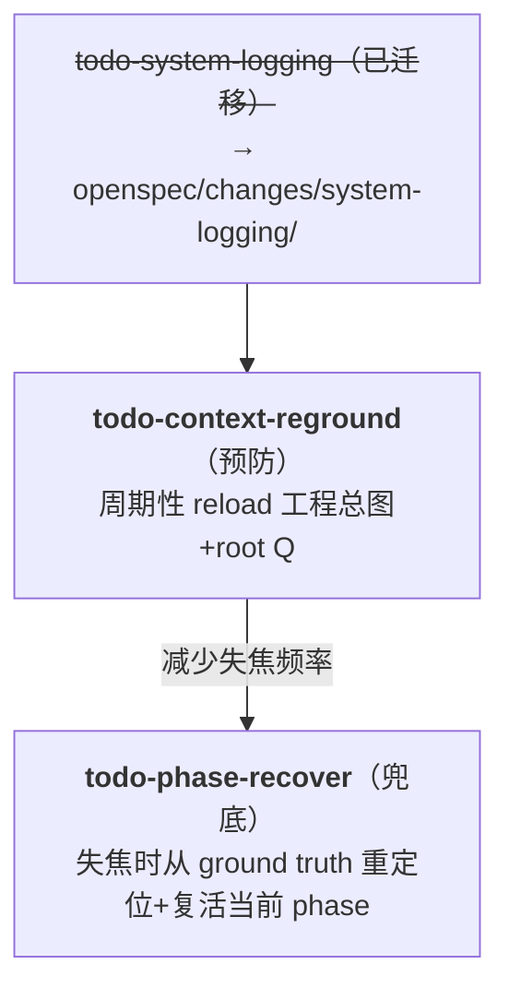
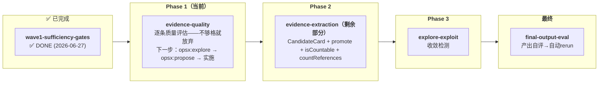

# Active Todos

活跃 todo，完成后移入 [`_done/_done_todos/`](../_done/_done_todos/)。

## 完成一个 todo 的步骤

1. `git mv todos/todo-<name>.md _done/_done_todos/todo-<name>.md`
2. 更新 `_done/_done_todos/README.md`（加一行）
3. 更新本文件（删掉该 todo）
4. 更新 `../_done/README.md`（DONE 计数 +1）

**todo 和 bug 不同——todo 没有编号，只有 slug 名。命名权威是文件名本身。**

---

## 活跃列表

| # | 文件 | 优先级 | 简述 | 阻塞条件 |
|---|------|--------|------|----------|
| 0 | `todo-helper-not-tool.md` | **北星（UX 层北极）** | 让系统成为"靠谱的同事"——四根支柱：记忆、主动、沟通、同频 | hitl-ux ✅（环机制已就位） |
| 1 | `todo-evidence-quality.md` | **最高（当前优先）** | 逐条证据质量评估——不够格就**放弃**（discard，不是 repair） | evidence-extraction 部分完成 |
| 2 | `todo-evidence-extraction.md` | **高** | 来源→结构化 reference——**部分完成：CCC section + _cache/ 约定已落地；CandidateCard/promote/isCountable/countReferences/Engine-computed ref_count 待实现** | prototype-subagent ✅ |
| 3 | `todo-explore-exploit.md` | **高** | 搜索收敛检测与方向决策（wave 级） | evidence-quality 集成 |
| 4 | `todo-final-output-eval.md` | **中** | 最终产物整体评估——不够格就自动 rerun | evidence-quality + explore-exploit 信号 |
| 5 | `todo-hooks-deferral.md` | **延后** | V12 的 6 个 Boundary Hook | evidence 管理器就位 |
| 6 | `todo-phase-recover.md` | **中（升级，2026-07-01）** | 模型失焦时从 ground truth 重新定位并复活当前 phase | check-reentry.mjs ✅ |
| 7 | `todo-context-reground.md` | **低（parked）** | 长上下文定期 reload 工程总图+root question | plan-hostfile ✅ |
| 8 | `todo-coding-agent-setup-ux.md` | **中（launch 前抬起）** | 用户手册：怎么配 Claude Code/Codex 才不卡 | 无硬阻塞 |

## 分析文档中标记但未建 TODO 的待办

| 来源 | 内容 | 状态 |
|------|------|------|
| `_done/_done_todos/DONE-agentic-queue-landing-analysis.md` | wfq-wave1-intake-subagent（Change 2） | ✅ OpenSpec 已归档 |
| 同上 | wfq-wave2-synthesis（Change 3） | ✅ OpenSpec 已归档 |
| 同上 | wfq-delivery（Change 4） | ✅ OpenSpec 已归档 |
| `_done/_old_topics/_guideline/terminology-gap-audit.md` | ~253 处术语 gap 修复 | 无执行计划 |
| `_done/_old_topics/_trainsistion/` 全部 3 文件 | Transition 层清理（FSM dispatch bug + API 统一） | 发现但未建 change |

---

## 依赖链分析

### 核心流水线：wave1-sufficiency-gates（定标准）→ evidence-extraction → evidence-quality → explore-exploit → final-output-eval

**`todo-wave1-sufficiency-gates` 是上游设计约束**——它从 V12 的完整机制挖掘出 8 层 gap，定义"跑到什么程度算够"。evidence-extraction/quality/explore-exploit 是实现手段。

```mermaid
flowchart LR
    subgraph G1["<b>wave1-sufficiency-gates</b><br/>标准层：多高才算够"]
        A1["研究画像+floor公式"]
        A2["isCountable规则"]
        A3["Must-Answer合约"]
        A4["Stop Conditions"]
    end
    subgraph G2["<b>evidence-extraction</b><br/>per-source：拿"]
        B1["URL → reference"]
        B2["含硬数据/干货"]
        B3["countReferences()"]
    end
    subgraph G3["<b>evidence-quality</b><br/>per-source：评"]
        C1["逐条质量评估"]
        C2["不够格就放弃"]
        C3["discard ≠ repair"]
    end
    subgraph G4["<b>explore-exploit</b><br/>wave 级：够不够"]
        D1["跨 wave 收敛检测"]
        D2["继续/换向/结束"]
    end
    subgraph G5["<b>final-output-eval</b><br/>run 级：该不该交付"]
        E1["最终产物自评"]
        E2["交付/自动rerun"]
    end
    G1 --> G2 --> G3 --> G4 --> G5
```



**关键洞察**：evidence-extraction 解决根本信任问题——**`ref_count` 变成 Engine 计算的派生值**，不再由 Agent 声明。这直接解锁 evidence-quality，进而解锁 explore-exploit，最后解锁 final-output-eval。evidence-quality 新增了**放弃**动作——烂材料直接排除，不修。

### 独立项

**`todo-hooks-deferral`** 明确延后，依赖链为：
```
schema-core → prototype-start-from-here → gate-loop/gate-fork → workflows/hooks
```

### 健壮性 / 元机制（正交于核心流水线）

三个 TODO（#6-8）针对"模型在长程运行中跑糊涂 / 无法事后排查"，与核心 evidence 流水线**正交**：



### 正交的 UX 项

**`todo-hitl-ux`** ✅ DONE 和 **`todo-helper-not-tool`**（北星）与上述正交——hitl-ux 解决交互结构，helper-not-tool 解决人格层。

---

## 推荐执行顺序（2026-06-27 更新）

**决定：evidence-quality 现在走。理由：sufficiency-gates ✅ DONE（标准已定）、evidence-extraction 部分完成（CCC section + _cache/ 约定已落地）。**



✅ 已完成：BUG-007、rerun-incremental-node、plan-hostfile-sections、wave1-sufficiency-gates、harden-stop-contract

### 为什么 evidence-quality 现在走

| 维度 | 判断 |
|------|------|
| **上游标准已就位** | sufficiency-gates ✅ DONE——质量参数已在 4 套 research style JSON 中定义 |
| **extraction 部分完成** | CCC section + `_cache/` 约定已落地，reference template 已有结构化内容可评估 |
| **discard 路径是 pipeline 的转折点** | quality 新增 `fail_c` 分支（不够格就放弃），之后 explore-exploit/final-output-eval 都需要可信的 discard 后 ref_count |
| **下一步** | `opsx:explore evidence-quality` → `opsx:propose` → 实施 |
