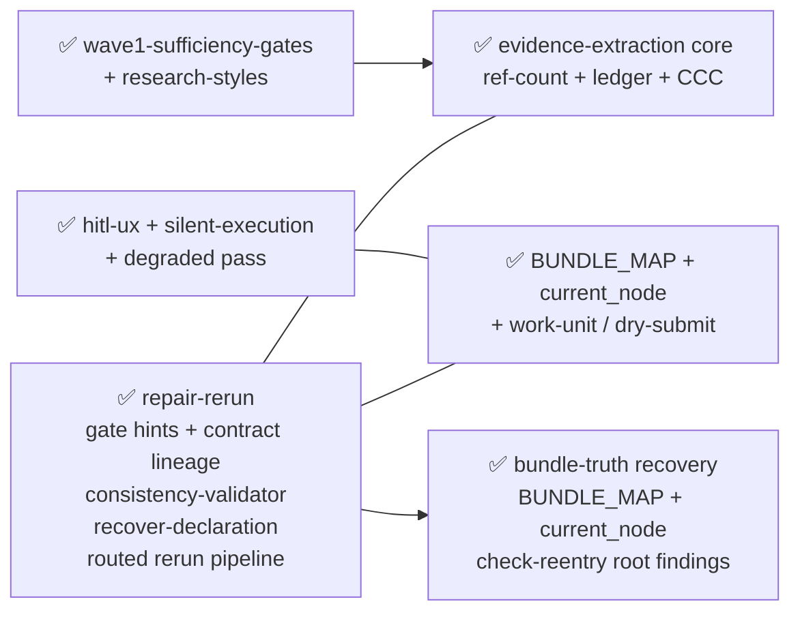
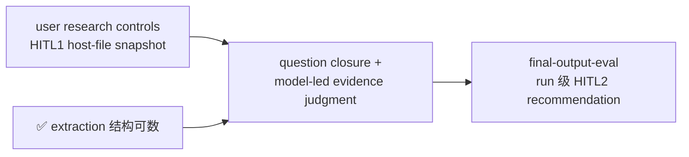
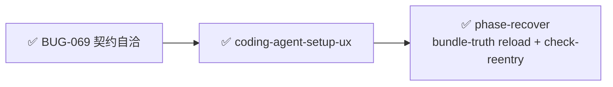
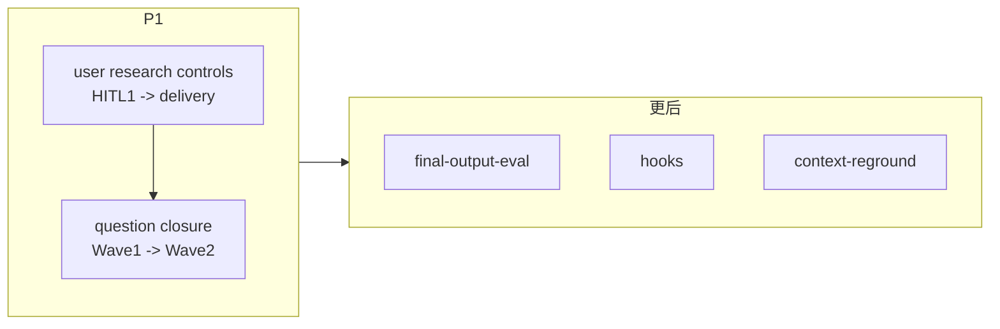

# Active Todos — 活跃 todo + 依赖链 + 执行顺序

> 最后更新: 2026-08-11 | `_backlog/todos/` — 活跃 todo 在此，做完移入 [`../_done/_done_todos/`](../_done/_done_todos/)。
>
> **本文件是所有活跃工作的中枢。** todo 没有编号，文件名即标识。完成后文件名不变，位置即状态。
>
> **2026-07-22 基线同步：** framework 已到 v0.40。v0.38–0.40 已增加 closed direct-output contract、actor-bound role/shared guidance delivery、同源 dry-submit/Wave evaluator 与 bounded page-fetch guidance；`check-reentry` + bundle-truth reload guidance 已完成 `todo-phase-recover`。所有后续 TODO 必须先证明现有 accepted owner 缺少直接事实，不能为测试、runner 或预防性机制重复造 controller。
>
> **2026-07-09 地基对齐：** work-unit + ledger + `ref-count.mjs` + HITL UX + BUNDLE_MAP 已落地；README 与若干 todo 仍停在 CandidateCard / `fail_c` / START_FROM_HERE /「extraction ~60%」叙事 — 已按当前系统收窄。

## 实施完成一个 todo 的步骤

1. `git mv todos/todo-<name>.md _done/_done_todos/todo-<name>.md`
2. 更新 `_done/_done_todos/README.md`（加一行）
3. 更新本文件（删掉该 todo）
4. 更新 `../_done/README.md`（DONE 计数 +1）

**todo 和 bug 不同——todo 没有编号，只有 slug 名。命名权威是文件名本身。**

若 standalone TODO 被活跃 plan 吸收而非实现，或经审计被现行 accepted contracts 替代/退役，仍用 `git mv` 保留原文，并在 `_done/_done_todos/README.md` 对应的非实现表登记；不分配 `DONE-NNN`，也不增加 DONE 计数。

---

## 活跃列表

| # | 文件 | 优先级 | 简述 | 阻塞 / 备注 |
|---|------|--------|------|-------------|
| 1 | `todo-final-output-eval.md` | **低–中（需重述）** | 交付前 read-only diagnostic → HITL2 recommendation | 后续消费统一的问题闭环；不得 auto-rerun 或绕过 HITL2 |
| 2 | `todo-hooks-deferral.md` | **延后 / parked** | workflow boundary hooks | 仅在现有 Gate/inspect/reentry 有真实直接缺口时重启 |
| 3 | `todo-context-reground.md` | **parked** | head re-ground | recovery 已 DONE；仅在现有 reload 不足的真实 case 下重启 |

### 本轮已移出活跃

| 文件 | 处置 |
|------|------|
| `todo-evidence-extraction.md` | ✅ **DONE-015** — 核心已落地（ledger + `countReferences`/`isCountable` + cache_coverage）；残余并入 evidence-quality |
| `todo-phase-recover.md` | ✅ **DONE-016** — `check-reentry`、BUNDLE_MAP/status/trace reload、post-Final 和 declaration recovery 已提供 Agent-facing bundle-truth recovery |
| `todo-evidence-quality.md` | → **archived as absorbed input**（非已实现）— 不再独立建设语义 source score / semantic countability；并入已关闭的 `research-question-closure-and-evidence-judgment` plan |
| `todo-explore-exploit.md` | → **archived as absorbed input**（非已实现）— 不再独立建设 WaveStats / strategy projection；并入同一已关闭 plan |
| `todo-user-knowledge-hang.md` | → **archived as absorbed input**（非已实现）— 用户的 per-run「找/鉴/写」控制并入已关闭 plan；采用 host-file snapshot，而非外部 live knowledge-pack contract |
| `todo-topic-specific-research-effort.md` | → **archived as absorbed input**（非已实现）— 政策探索已由 `topic-research-emphasis` plan（2026-08-08 用户确认 D-001~D-010）闭环：emphasis 是公共基线之后的增量自然语言 focus，不是 per-Topic source-count floor；全局 `wave0_per_topic_source_floor` 未改动，未建 override 字段 |
| `todo-helper-not-tool.md` | → **archived as superseded/retired input**（非已实现）— HITL 对话、per-run controls、静默自主、Final 中文交付与 helper-oriented responsibility 已有 accepted owner；跨 run memory 仅在真实 run 证明直接缺口后重新独立 explore。 |
| BUG-069（外部） | ✅ **已修复** — 移入 `_done/_fixed_bugs/`；P2 降级，5/6 failure point 已修；gate hints + contract lineage 系统性解决契约漂移 |
| `todo-coding-agent-setup-ux` | ✅ **已关闭** — 移入 `_done/_closed_plans/ux-coding-agent-permissions-setup.md` |

---

## 依赖链（2026-07-22 同步）

### 已完成地基（勿再当「下一步」）

**2026-07-15 新增地基：** repair-rerun 带来了 gate hints（结构化 repair 方向）、contract lineage（Agent/Engine 契约自洽）、consistency-validator（workflow package 全量校验）、recover-declaration（从 owners + hash 重建 ledger row）、routed rerun pipeline（新增 topic 走正常 Wave0/Wave1 队列）。

### 核心研究闭环（统一后）

**关键纠正：**

- extraction 不再通向另一套语义 countability；结构计数和 provenance 保持现有 owner
- 用户先用自然语言声明本次研究的优先级、排除项、来源/证据政策和交付需要；模型在该控制下按具体问题判断证据是否够、该 exploit 还是 explore；Engine 只守持久输入、问题交接与既有 route/receipt binding
- 第一 Change 把可选用户控制从 HITL1 贯通到 delivery；第二 Change 才补 Wave1→Wave2 问题交接。Wave0 只消费搜索/证据 guidance，不新增问题生命周期
- 删除 CandidateCard / promote / `fail_c` / `EvidenceQuality` / `WaveStats` 作为默认路径叙事
- wave **degraded pass** ≠ run-level HITL2 rerun recommendation

### 可跑性车道（P0 已清空 ✓）

P0 阻塞项（BUG-069 + setup-ux）已清零。phase-recover 已由 BUNDLE_MAP/status/trace reload guidance、`check-reentry` root findings 和 narrow recovery owners 关闭；不再是活跃实现项。

### Hooks

延后。前驱已满足，但没有真实 boundary gap 时不得新增 hooks；`workflows/hooks/` 仍不存在。≠ coding-agent PreToolUse。

---

## 推荐执行顺序（2026-07-22 历史快照）

P0 可跑性阻塞已清零。以下保留当时的统一研究闭环排序；`research-question-closure-and-evidence-judgment` plan 已关闭，当前工作以本文件的活跃列表为准：

| 顺序 | 项 | 为什么 |
|------|-----|--------|
| 1 | `research-question-closure-and-evidence-judgment` plan, Change 1（已关闭） | HITL1 将可选用户控制快照到 `rb_plan.md`，Seed/Wave/Final 通过现有 guidance/task brief 读取；不加 profile/path/manifest/Gate 子系统 |
| 2 | same plan, Change 2（已关闭） | 让模型已声明的 Wave1 carry-forward target 在 Wave2 有可验证去向；Wave0 不新增问题生命周期，不重做 countability 或 actor contract |
| 3 | final-output-eval | pipeline 后段；复用用户控制、问题闭环和可见 limitation，只给 HITL2 recommendation，不自动 rerun |
| 4 | hooks / reground | 必须各自先有真实直接缺口；不为预防或测试嵌套机制 |

---

## 分析文档中标记但未建 TODO 的待办

| 来源 | 内容 | 状态 |
|------|------|------|
| `_done/_old_topics/_guideline/terminology-gap-audit.md` | ~253 处术语 gap | 无执行计划；低优先 |
| `_done/_old_topics/_trainsistion/` | Transition 层清理 | 发现但未建 change；多数 FSM 问题可能已随 WFF 归档消化 — 启用前先核对 |
| `_backlog/plans/ux-user-facing-chinese-first-outside-waves.md` | prefer-Chinese 软提示 | 已由 HITL UX 与 Final delivery contracts 覆盖；无需以 helper 立项 |
| `_backlog/_done/_closed_plans/research-question-closure-and-evidence-judgment/` | 用户 per-run 控制 + 问题闭环 | 已关闭（CLS-034）；per-run controls 已落入 accepted contract，不再作为 helper TODO 前置 |
| `openspec/changes/archive/2026-07-15-seed-backfill-round-continuity/` | backfill tokens 与 round continuity | 已 archive；不再是 active plan 或 TODO 前置 |
| `_backlog/_done/_closed_plans/agent-output-linter.md` | Agent 输出 direct-contract feedback | 已由 `reuse-delegated-output-contracts-at-submit` v0.38 落地并归档（CLS-032） |
