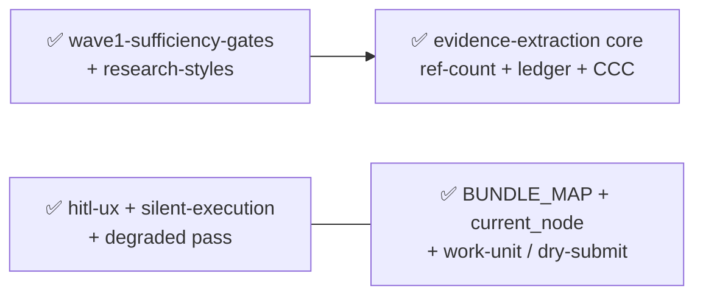
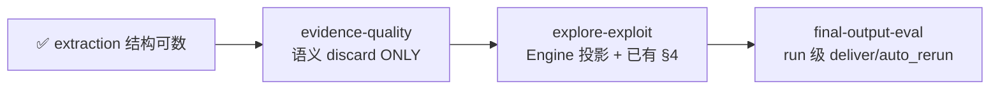
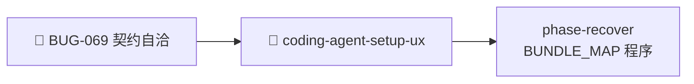
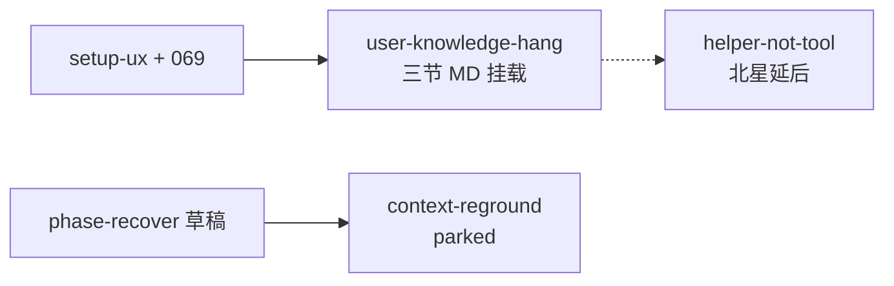
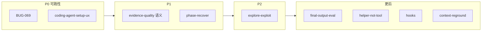

# Active Todos — 活跃 todo + 依赖链 + 执行顺序

> 最后更新: 2026-07-09 | `_backlog/todos/` — 活跃 todo 在此，做完移入 [`../_done/_done_todos/`](../_done/_done_todos/)。
>
> **本文件是所有活跃工作的中枢。** todo 没有编号，文件名即标识。完成后文件名不变，位置即状态。
>
> **2026-07-09 地基对齐：** work-unit + ledger + `ref-count.mjs` + HITL UX + BUNDLE_MAP 已落地；README 与若干 todo 仍停在 CandidateCard / `fail_c` / START_FROM_HERE /「extraction ~60%」叙事 — 已按当前系统收窄。

## 完成一个 todo 的步骤

1. `git mv todos/todo-<name>.md _done/_done_todos/todo-<name>.md`
2. 更新 `_done/_done_todos/README.md`（加一行）
3. 更新本文件（删掉该 todo）
4. 更新 `../_done/README.md`（DONE 计数 +1）

**todo 和 bug 不同——todo 没有编号，只有 slug 名。命名权威是文件名本身。**

---

## 活跃列表

| # | 文件 | 优先级 | 简述 | 阻塞 / 备注 |
|---|------|--------|------|-------------|
| — | （外部）[BUG-069](../bugs/BUG-069-silent-autonomous-execution-unreachable-contract-not-self-sufficient.md) | **P0 meta** | Agent-facing 契约不自洽 → 静默自主不可达 | 非 todo，但挡住 UX/auto_rerun |
| 1 | `todo-coding-agent-setup-ux.md` | **高（launch）** | 宿主权限手册 + 可选 allowlist，真跑不卡 | 与 069 并行；permissions ≠ 契约自洽 |
| 2 | `todo-evidence-quality.md` | **高（已收窄）** | **语义** discard（substance/tier/…）；结构计数已 DONE | 勿重做 CCC/`fail_c`/CandidateCard |
| 3 | `todo-phase-recover.md` | **中–高** | 失焦时从 BUNDLE_MAP + status 重定位 | 勿再写 START_FROM_HERE |
| 4 | `todo-explore-exploit.md` | **中（已收窄）** | Engine `WaveStats` 投影；§4 散文已有 | 等 quality 语义信号 |
| 5 | `todo-final-output-eval.md` | **低–中** | 交付前自评 → auto_rerun | ≠ wave degraded pass |
| 6 | `todo-helper-not-tool.md` | **北星 / 实施延后** | 同事人格层 | 硬前置：069 + setup-ux |
| 7 | `todo-user-knowledge-hang.md` | **中** | 小白可挂的「找/鉴/写」Markdown 知识包 | 越简单越好；软约束，不改 gate |
| 8 | `todo-hooks-deferral.md` | **延后** | workflow boundary hooks | evidence ownership ✅；仍等 069/recover |
| 9 | `todo-context-reground.md` | **parked** | head re-ground | 等 recover 草稿；真相源 = BUNDLE_MAP |

### 本轮已移出活跃

| 文件 | 处置 |
|------|------|
| `todo-evidence-extraction.md` | ✅ **DONE-015** — 核心已落地（ledger + `countReferences`/`isCountable` + cache_coverage）；残余并入 evidence-quality |

---

## 依赖链（2026-07-09 重写）

### 已完成地基（勿再当「下一步」）

### 核心研究质量流水线（收窄后）

**关键纠正：**

- extraction → quality 不再是「解锁计数」— 计数已解锁；quality 只补**语义**层
- 删除 CandidateCard / promote / `fail_c` 作为默认路径叙事
- wave **degraded pass** ≠ run **auto_rerun**

### 可跑性车道（正交，当前应优先）

### 人格 / 预防 / 用户口味（延后或中优先）

`user-knowledge-hang`：静态口味包，小白可挂；**先于** helper 跨 run 记忆。不阻塞 P0。

### Hooks

延后。前驱「evidence ownership」已满足；新 deferral 条件 = 069 + recover 方向清楚。`workflows/hooks/` 仍不存在。≠ coding-agent PreToolUse。

---

## 推荐执行顺序（2026-07-09）

**不再「evidence-quality 现在就走」为唯一头条。** 真跑与静默契约比人格/语义评分更堵。

| 顺序 | 项 | 为什么 |
|------|-----|--------|
| 1 | BUG-069 + setup-ux | 没有自洽契约 + 权限，静默与「同事」都是空话 |
| 2 | evidence-quality（窄） | 结构可数已有；补语义 discard |
| 2′ | phase-recover | 真跑失焦 / 超时现场需要 |
| 3 | explore-exploit | 在已有 §4 上加 Engine 投影 |
| 4 | final-output-eval | pipeline 末端 |
| 5 | helper-not-tool / hooks / reground | 北星或 parked |

---

## 分析文档中标记但未建 TODO 的待办

| 来源 | 内容 | 状态 |
|------|------|------|
| `_done/_old_topics/_guideline/terminology-gap-audit.md` | ~253 处术语 gap | 无执行计划；低优先 |
| `_done/_old_topics/_trainsistion/` | Transition 层清理 | 发现但未建 change；多数 FSM 问题可能已随 WFF 归档消化 — 启用前先核对 |
| `_backlog/plans/ux-user-facing-chinese-first-outside-waves.md` | prefer-Chinese 软提示 | 可并入 helper 极轻步或独立小 change；可不立项 |
| `todo-user-knowledge-hang.md` | 用户「找/鉴/写」口味包挂载 | 活跃 todo；比 helper 记忆简单，可先于人格层 |
